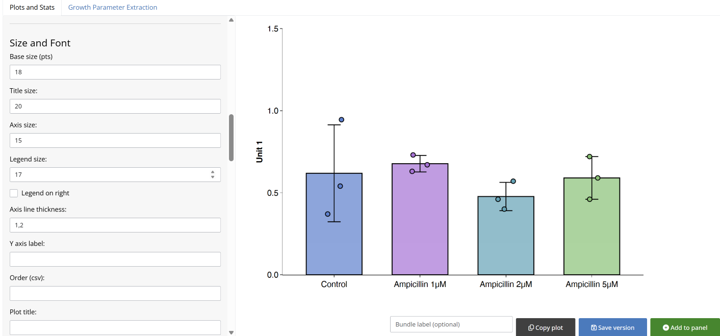
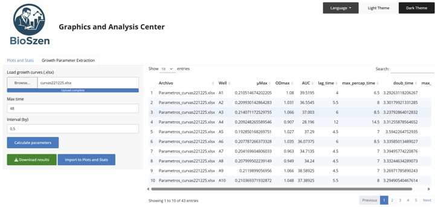
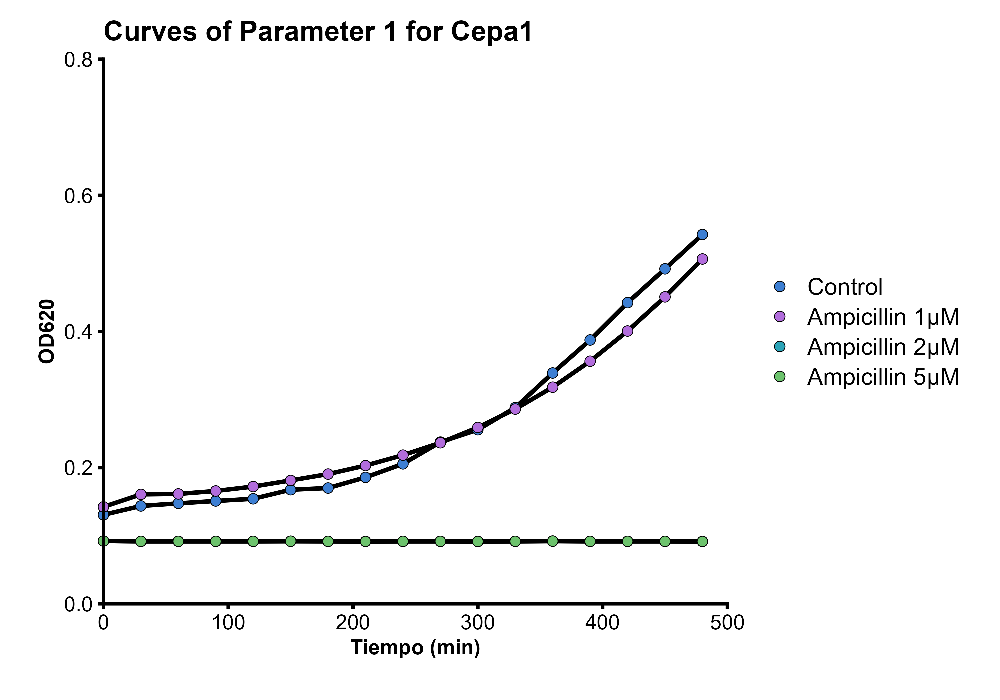
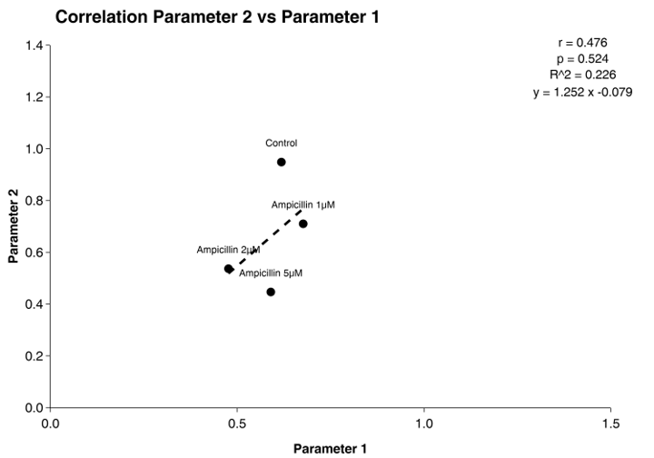

# BIOSZEN

BIOSZEN is an application for data analysis and visualization based on Excel input files. It can generate boxplots, bar plots, curve plots, violin plots, stacked plots, and correlation plots between parameters. The app includes normality tests such as Shapiro–Wilk, Kolmogorov–Smirnov, and Anderson–Darling, as well as significance tests including ANOVA, Kruskal–Wallis, Student’s t-test, and the Wilcoxon test. In addition, BIOSZEN can extract microbial growth curve parameters:

- `uMax`: maximum specific growth rate estimated from the exponential phase.
- `max_percap_time`: mean time across the exponential-phase window used for uMax.
- `doub_time`: doubling time (ln(2) / uMax).
- `lag_time`: estimated lag phase duration before exponential growth.
- `ODmax`: maximum observed optical density (or measurement value).
- `max_time`: time at which ODmax occurs.
- `AUC`: area under the growth curve.

## Requirements
- R >= 4.1 (required; RStudio recommended for opening and reviewing scripts).
- Internet connection to install dependencies the first time.

## Quickstart

1. **Recommended (simplest): run with RStudio**
   1. Make sure **R** and **RStudio** are installed on your system.
   2. Download `BIOSZEN-vX.Y.Z-bundle.zip`.
   3. Unzip it and open the `BIOSZEN-vX.Y.Z` folder.
   4. Open the corresponding `.R` launcher in **RStudio**:
      - macOS (self-contained): `BIOSZEN-vX.Y.Z-mac-App.R`
      - Windows (self-contained): `BIOSZEN-vX.Y.Z-win-App.R`
      - Cross-platform (requires `BIOSZEN-vX.Y.Z.tar.gz` in the same directory): `App.R`
   5. Click **Source** (top-right button in the script editor) to launch the app.
   6. The app opens at `http://127.0.0.1:4321`.

2. **Alternative: run from the terminal**
   1. Open Terminal (macOS) or PowerShell (Windows) in the `BIOSZEN-vX.Y.Z` folder.
   2. Run one of these launchers:
      - `Rscript App.R` (macOS and Windows, requires `BIOSZEN-vX.Y.Z.tar.gz`
        in the same directory).
      - macOS: `Rscript BIOSZEN-vX.Y.Z-mac-App.R` (self-contained).
      - Windows: `Rscript BIOSZEN-vX.Y.Z-win-App.R` (self-contained).
   3. The app opens at `http://127.0.0.1:4321`.

## First run (one-time setup)

The first time you launch BIOSZEN, it will download and install the required R packages and save them in a local folder called `R_libs` inside the BIOSZEN directory. **Do not delete this folder**. If `R_libs` is removed, BIOSZEN will need to download the dependencies again the next time you run it.

After this initial setup, BIOSZEN can run **offline**, as long as the `R_libs` folder remains in place.

## Files used by the user
- `BIOSZEN-vX.Y.Z.tar.gz`: package used by `App.R`.
- `App.R`: launcher for macOS and Windows; it requires the tarball in the same
  directory.
- `BIOSZEN-vX.Y.Z-mac-App.R`: self-contained launcher for macOS.
- `BIOSZEN-vX.Y.Z-win-App.R`: self-contained launcher for Windows.
- `inst/app/www`: user guides in English and Spanish.

## Gallery (quick view)

Key app screens (full set in `Gallery/screenshots/app`):

- Home overview:  
  
- Plot setup and layers:  
  
- Correlation and statistics setup:  
  
- Normality and significance options:  
  
- Growth parameter extraction:  
  

Plot examples (full set in `Gallery/screenshots/plots`):

- Boxplot:  
  
- Growth curves:  
  
- Correlation heatmap:  
  

## Troubleshooting
- `Rscript` not found: use the full path to `Rscript` or add R to PATH.
- Missing packages: check Internet access and review `bioszen_r.log` in the folder.
- macOS Gatekeeper: `xattr -dr com.apple.quarantine <folder>`.
- Port 4321 in use: edit `App.R` and change `shiny.port`.

## How to cite
Szenfeld, B. (2026). BIOSZEN (1.0.0). Zenodo. https://doi.org/10.5281/zenodo.18217522

## License
GPL-3.0.
