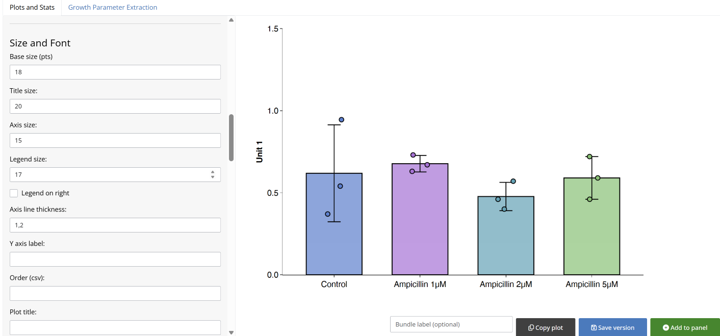
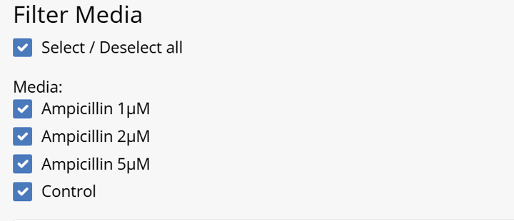
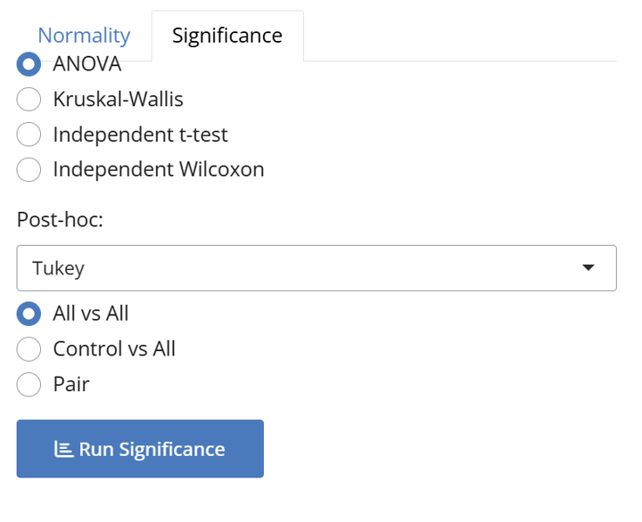
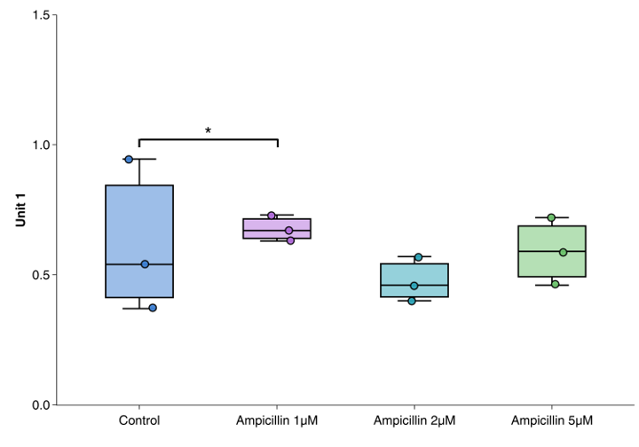
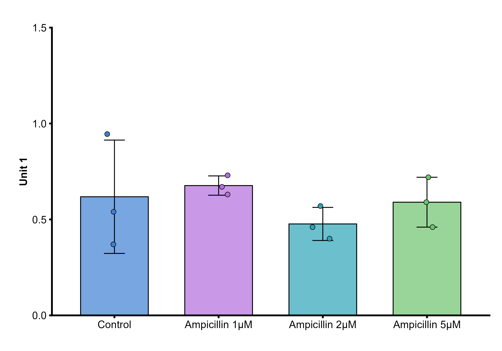
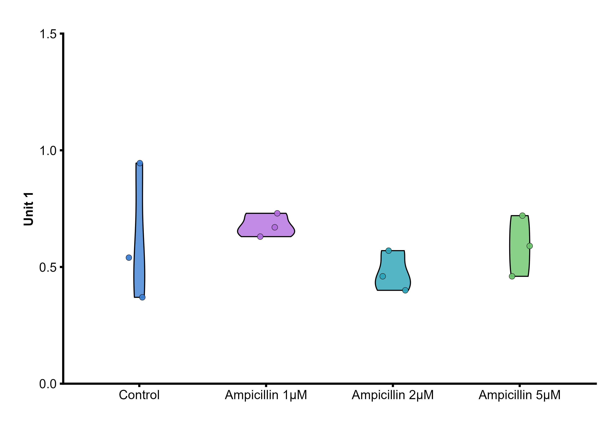
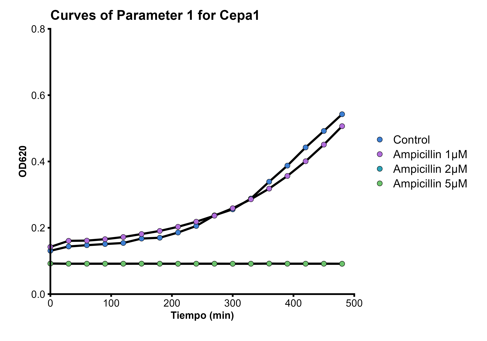
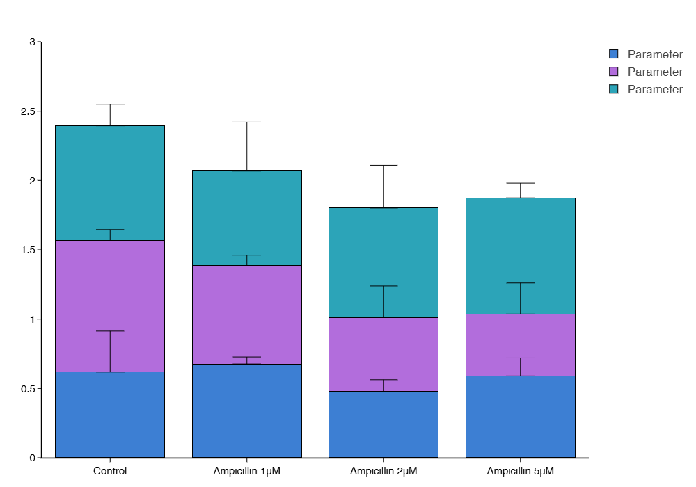
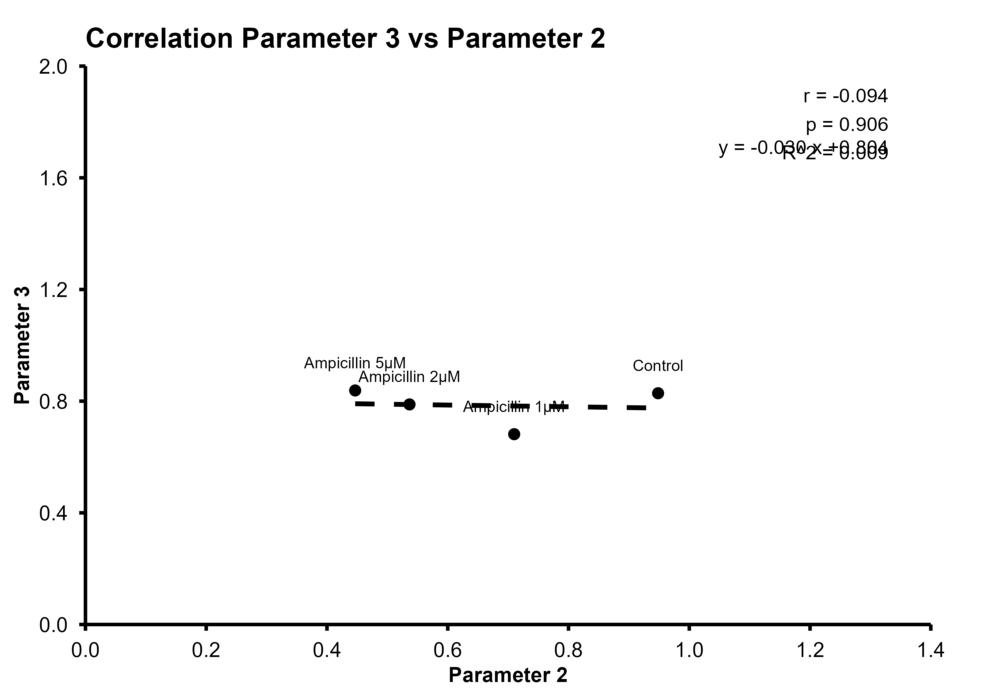

<div align="center">
  

# BIOSZEN

**Biological data analysis and visualization in R/Shiny**  
From data import to reproducible plots, statistics, metadata, and bundle exports.
</div>


> **IMPORTANT:**
> For the most complete workflow, use **Platemap + Curves** input mode (`Datos` + `PlotSettings` + well-based curves).

> **TIP:**
> If your dataset is large, start with `.csv` in **Load Data** and keep metadata as `.xlsx`.

## Table of Contents

- [Why BIOSZEN](#why-bioszen)
- [Core Capabilities](#core-capabilities)
- [Quick Start](#quick-start)
- [Choose the Right Input Mode](#choose-the-right-input-mode)
- [Recommended Workflow](#recommended-workflow)
- [Visual Gallery](#visual-gallery)
- [Common User Scenarios](#common-user-scenarios)
- [Documentation](#documentation)
- [Troubleshooting](#troubleshooting)
- [Citation](#citation)
- [License](#license)

## Why BIOSZEN

BIOSZEN is an R package with a modular Shiny app focused on biological experiment analysis. It helps you go from raw data to publication-ready visualizations while preserving reproducibility through metadata and bundle exports.

## Core Capabilities

- Plot families: **Boxplot**, **Barplot**, **Violin**, **Curves**, **Stacked**, **Correlation**, **Heatmap**, **Correlation Matrix**.
- Statistical workflows: normality checks, significance testing, post hoc comparisons, p-value correction.
- Control-based normalization with replicate-aware behavior.
- Biological and technical replicate QC (manual + automatic strategies).
- Composition panel for multi-plot layouts and export (`PNG`, `PDF`, `PPTX`).
- Reproducibility features: metadata export/import and ZIP bundles.
- Growth module with extracted metrics: `uMax`, `doub_time`, `lag_time`, `AUC`, `ODmax`, and related fields.

## Quick Start

1. Install **R (>= 4.1)**.
2. Open this project folder.
3. Run one of the following:

```bash
Rscript app.R
```

Or inside R:

```r
BIOSZEN::run_app()
```

4. Open the local URL shown in the console.

> **NOTE:**
> On first launch, dependencies may be installed into a local `R_libs` directory. Keep this folder to avoid reinstalling packages.

## Choose the Right Input Mode

- **Platemap + Curves (recommended)**  
  Use it when: You need full plotting + stats + replicate/QC workflows.  
  Required files: `Datos` + `PlotSettings` workbook, plus curves file (`Time` + wells).

- **Grouped parameters**  
  Use it when: You only need parameter plots/statistics.  
  Required files: Grouped parameter workbook in **Load Data**.

- **Summary (Mean/SD/N)**  
  Use it when: Raw replicate rows are not available.  
  Required files: Summary workbook with dedicated summary sheets.

- **CSV mode**  
  Use it when: Dataset is large and you want lighter IO.  
  Required files: `.csv` for data and/or curves; metadata still `.xlsx`.

## Recommended Workflow

1. Load primary file in **Load Data**.
2. Optionally load curves in **Load Curves**.
3. Apply filters (group/media/replicate).
4. Choose plot type and visual settings.
5. Optionally normalize by control.
6. Run statistics and significance annotation.
7. Export plot/data/statistics/metadata/bundle.

> **CAUTION:**
> If curves do not align with your groups, verify the `Well` mapping in platemap and the curves column names (`A1`, `A2`, etc.).

## Visual Gallery

### App Screens

<div align="center">
  
  
</div>

<div align="center">
  
  
</div>

### Plot Examples

<div align="center">
  
  
  
</div>

<div align="center">
  
  
  
</div>

## Common User Scenarios

### I only have summary tables

- Use **Summary (Mean/SD/N)** mode.
- Focus on parameter visualization and supported statistical paths.
- Expect some normality/non-parametric options to be limited if raw observations are unavailable.

### I need stronger replicate quality control

- Use `BiologicalReplicate` and `TechnicalReplicate` columns.
- Start with manual include/exclude.
- Then apply IQR filtering and Keep-N reproducibility filters.

### I need reproducible, shareable output

- Export **metadata** after configuring your analysis.
- Export **bundle ZIP** at the end.
- Re-import metadata in a new session to restore state.

## Documentation

- Main English manual: `inst/app/www/MANUAL_EN.md`
- Main Spanish manual: `inst/app/www/MANUAL_ES.md`
- PDF manuals:
  - `inst/app/www/MANUAL_EN.pdf`
  - `inst/app/www/MANUAL_ES.pdf`
- Input templates: `inst/app/www/reference_files/`

Reference templates include:

- [Ejemplo_platemap_parametros.xlsx](inst/app/www/reference_files/Ejemplo_platemap_parametros.xlsx)
- [Ejemplo_curvas.xlsx](inst/app/www/reference_files/Ejemplo_curvas.xlsx)
- [Ejemplo_parametros_agrupados.xlsx](inst/app/www/reference_files/Ejemplo_parametros_agrupados.xlsx)
- [Ejemplo_input_summary_mean_sd.xlsx](inst/app/www/reference_files/Ejemplo_input_summary_mean_sd.xlsx)

## Troubleshooting

- **`Rscript` not found**  
  Quick check: Install R and ensure `Rscript` is on `PATH` (or run with full executable path).

- **Upload rejected**  
  Quick check: Verify required sheet names and column names.

- **No plot shown**  
  Quick check: Confirm selected parameter/group still exists after filters.

- **Stats unavailable**  
  Quick check: Check whether your input mode supports the selected statistical route.

- **Slow performance**  
  Quick check: Reduce selected parameters and disable heavy overlays.

## Citation

Szenfeld, B. (2026). BIOSZEN (2.0.1). Zenodo. https://doi.org/10.5281/zenodo.18217522

## License

GPL-3.0

