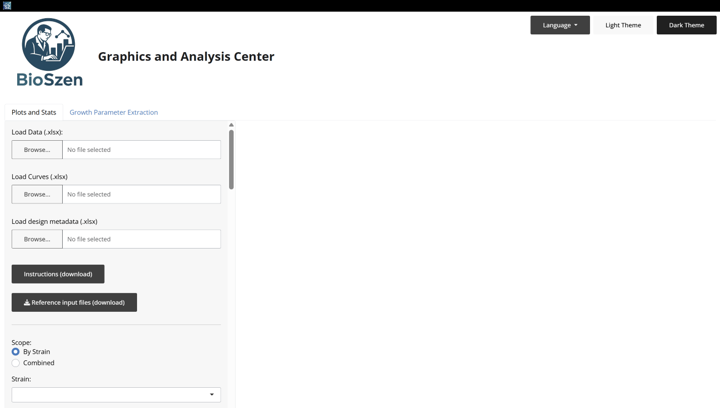
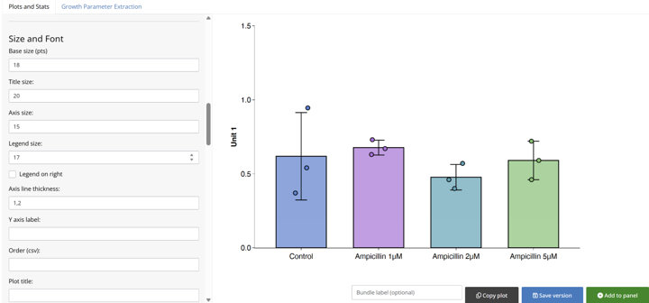
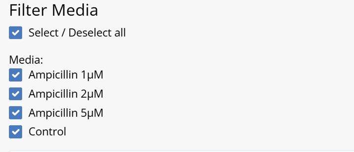
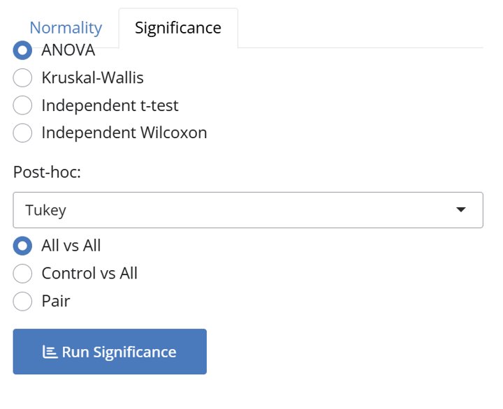
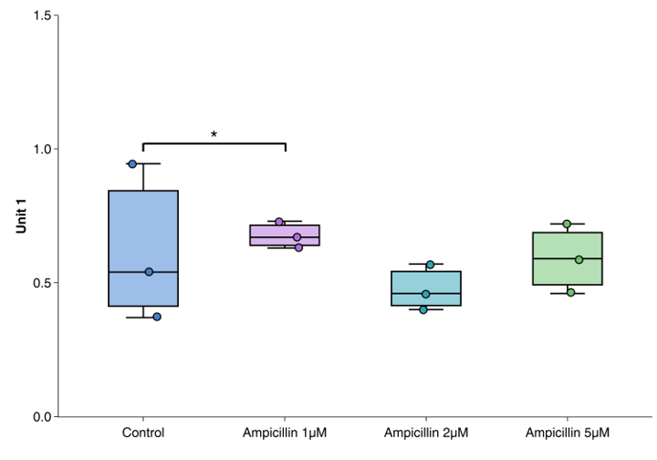
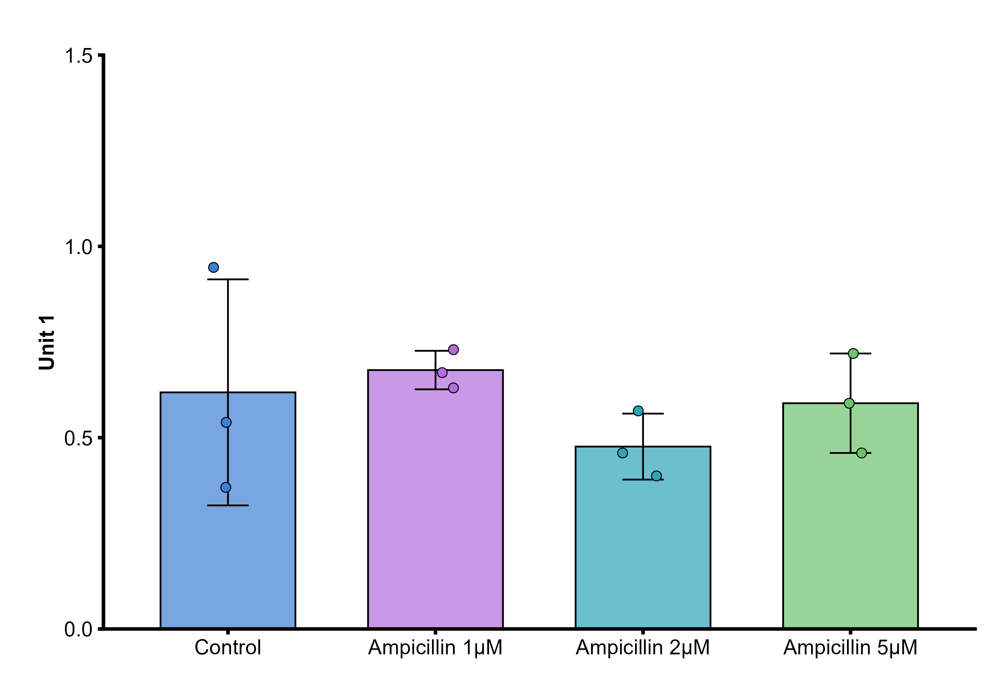
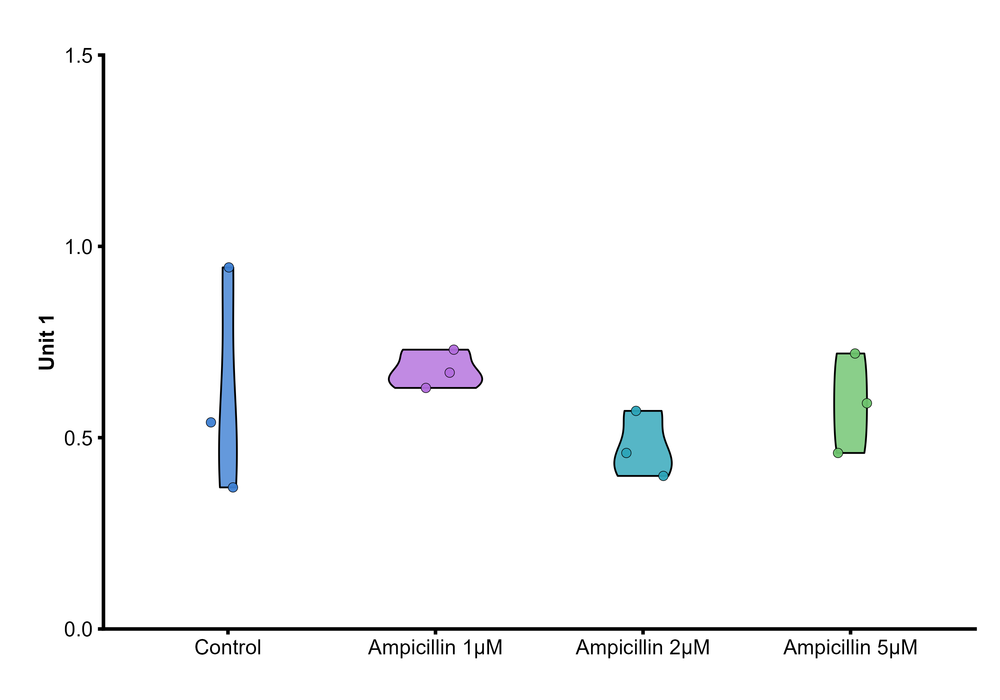
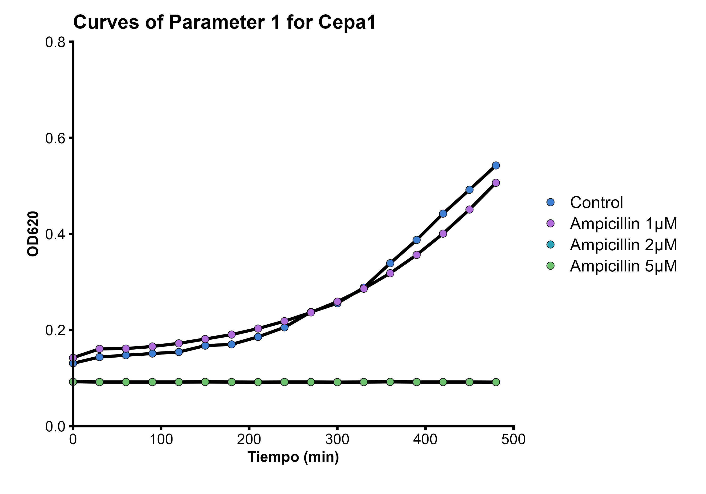
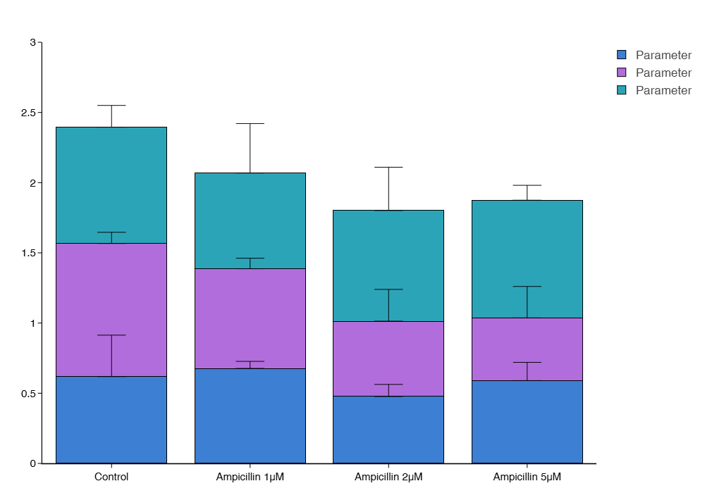
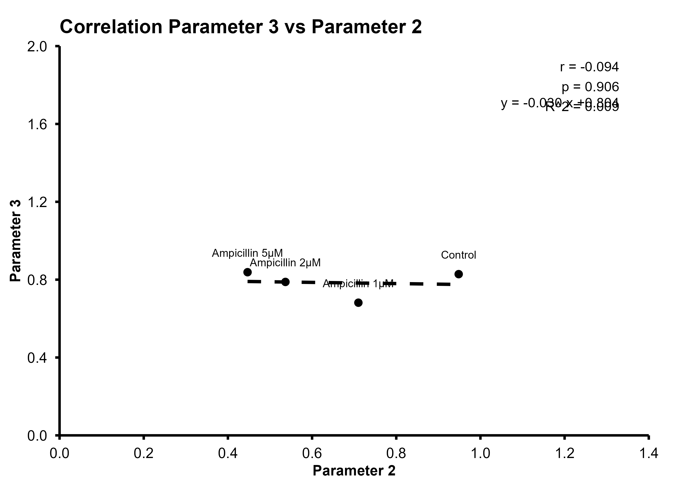

<div align="center">
  

# BIOSZEN

**Biological data analysis and visualization in R/Shiny**  
From data import to reproducible plots, statistics, metadata, and bundle exports.

[Project website](https://bioszen.github.io/BIOSZEN/) · [English manual](inst/app/www/MANUAL_EN.md) · [bio.tools](https://bio.tools/bioszen) · [R-universe](https://bioszen.r-universe.dev/) · [Zenodo](https://doi.org/10.5281/zenodo.18217210)
</div>



> **IMPORTANT:**
> For the most complete workflow, use **Platemap + Curves** input mode (`Datos` + `PlotSettings` + well-based curves).

> **TIP:**
> If your dataset is large, start with `.csv` in **Load Data** and keep metadata as `.xlsx`.

## Table of Contents

- [Why BIOSZEN](#why-bioszen)
- [Availability and Discovery](#availability-and-discovery)
- [Core Capabilities](#core-capabilities)
- [Quick Start](#quick-start)
- [R Commands](#r-commands)
- [Choose the Right Input Mode](#choose-the-right-input-mode)
- [Recommended Workflow](#recommended-workflow)
- [Visual Gallery](#visual-gallery)
- [Common User Scenarios](#common-user-scenarios)
- [Documentation](#documentation)
- [AI Skill for Input Preparation](#ai-skill-for-input-preparation)
- [Troubleshooting](#troubleshooting)
- [Citation](#citation)
- [License](#license)

## Why BIOSZEN

BIOSZEN is an R package with a modular Shiny app focused on biological experiment analysis. It helps you go from raw data to publication-ready visualizations while preserving reproducibility through metadata and bundle exports.

## Availability and Discovery

- **Project website:** <https://bioszen.github.io/BIOSZEN/>
- **English user manual:** [MANUAL_EN.md](inst/app/www/MANUAL_EN.md)
- **bio.tools registry:** <https://bio.tools/bioszen>
- **R-universe package page:** <https://bioszen.r-universe.dev/>
- **Limited online demo:** <https://bioszen-test.share.connect.posit.cloud>
- **Complete Zenodo record and version history:** <https://doi.org/10.5281/zenodo.18217210>

The bio.tools listing gives BIOSZEN a dedicated, persistent entry in the
community-driven registry of software and data resources for the life sciences.

## Core Capabilities

- Plot families: **Boxplot**, **Barplot**, **Violin**, **Curves**, **Stacked**, **Correlation**, **Heatmap**, **Correlation Matrix**.
- Statistical workflows: normality checks, significance testing, post hoc comparisons, and multiple-testing correction with Holm, FDR (Benjamini-Hochberg), Bonferroni, or no correction.
- Control-based normalization with replicate-aware behavior.
- Biological and technical replicate QC (manual + automatic strategies).
- Composition panel for multi-plot layouts and export (`PNG`, `PDF`, `PPTX`).
- Reproducibility features: metadata export/import and ZIP bundles.
- Growth module with extracted metrics: `µMax`, `doub_time`, `lag_time`, `AUC`, `ODmax`, and related fields.

## Quick Start

1. Install **R (>= 4.1)** and **RStudio** by following the step-by-step [R and RStudio download guide](https://bioszen.github.io/r-rstudio-download-guide/).
2. Extract the BIOSZEN bundle and open its folder.
3. Launch BIOSZEN using one of the following methods:

In RStudio, open `App.R` and click **Source**, or run:

```r
source("App.R")
```

From a terminal:

```bash
Rscript App.R
```

If BIOSZEN is already installed, you can also run:

```r
BIOSZEN::run_app()
```

The shorter equivalent is:

```r
BIOSZEN::BIOSZEN()
```

`BIOSZEN()` opens the app in the browser configured as the operating system
default. Use `BIOSZEN::BIOSZEN(app_window = TRUE)` to request a dedicated
app-style Chromium window instead. RStudio installs the BIOSZEN Addin
automatically with the package: restart RStudio after installation, then select
**Addins > Launch BIOSZEN in Browser** to launch it without typing code. A
keyboard shortcut can optionally be assigned from **Addins > Browse Addins >
Keyboard Shortcuts**.

4. Open the local URL shown in the console.

> **NOTE:**
> On first launch, dependencies may be installed into a local `R_libs` directory. Keep this folder to avoid reinstalling packages.

### Install from R-universe

```r
install.packages(
  "BIOSZEN",
  repos = c(
    "https://bioszen.r-universe.dev",
    "https://cloud.r-project.org"
  )
)
BIOSZEN::BIOSZEN()
```

After installation and an RStudio restart, **Addins > Launch BIOSZEN in
Browser** is registered automatically; no Addin files need to be copied or
installed manually.

Stable releases are selected in the BIOSZEN R-universe registry with the
`*release` branch pattern. See [R-universe setup](docs/R_UNIVERSE.md) for the
repository configuration and release checklist.

## R Commands

The Shiny app remains the main interactive workflow. These commands provide the
same core operations for scripts and reproducible pipelines:

```r
# Launch the app (run_app() remains supported)
BIOSZEN::BIOSZEN()

# Check for or install an approved update
BIOSZEN::bioszen_update_available()
BIOSZEN::bioszen_update()

# Official citation in text, bibentry, BibTeX, or DOI form
BIOSZEN::bioszen_citation()

# Extract the same growth parameters as the Shiny Growth tab
result <- BIOSZEN::growth_parameters("Curvas.xlsx")

# Optional workbook output; no file is written when output_dir is NULL
result <- BIOSZEN::growth_parameters(
  "Curvas.xlsx",
  max_time = 48,
  time_interval = 0.5,
  output_dir = "growth_results",
  overwrite = FALSE
)
```

The same update workflow is also available from the blue **Update** button at
the bottom of either app panel. The button never installs silently: it reports
when the installed stable version is current, or shows both versions and asks
for confirmation before closing the app and updating. The R commands above
remain supported. Save or download unsaved work before confirming; BIOSZEN
closes Shiny before replacing package files, and the update check does not send
uploaded data or credentials.

`growth_parameters()` accepts wide or tidy data frames, one or more Excel/CSV
files, or a directory. It uses the identical robust-first calculation and
permissive fallback as the Shiny module and returns the same parameter columns.

## Choose the Right Input Mode

- **Platemap + Curves (recommended)**  
  Use it when: You need full plotting + stats + replicate/QC workflows.  
  Required files: `Datos` + `PlotSettings` workbook, plus curves file (`Time` + wells).

- **Grouped parameters**  
  Use it when: You only need parameter plots/statistics.  
  Required files: Grouped parameter workbook in **Load Data**.

- **Summary (Mean/SD/N)**  
  Use it when: Raw replicate rows are not available.  
  Required files: Summary workbook with dedicated summary sheets.

- **CSV mode**  
  Use it when: Dataset is large and you want lighter IO.  
  Required files: `.csv` for data and/or curves; metadata still `.xlsx`.

## Recommended Workflow

1. Load primary file in **Load Data**.
2. Optionally load curves in **Load Curves**.
3. Apply filters (group/media/replicate).
4. Choose plot type and visual settings.
5. Optionally normalize by control.
6. Run statistics and significance annotation.
7. Export plot/data/statistics/metadata/bundle.

> **CAUTION:**
> If curves do not align with your groups, verify the `Well` mapping in platemap and the curves column names (`A1`, `A2`, etc.).

## Visual Gallery

### App Screens

<div align="center">
  
  
</div>

<div align="center">
  
  
</div>

### Plot Examples

<div align="center">
  
  
  
</div>

<div align="center">
  
  
  
</div>

## Common User Scenarios

### I only have summary tables

- Use **Summary (Mean/SD/N)** mode.
- Focus on parameter visualization and supported statistical paths.
- Expect some normality/non-parametric options to be limited if raw observations are unavailable.

### I need stronger replicate quality control

- Use `BiologicalReplicate` and `TechnicalReplicate` columns.
- Start with manual include/exclude.
- Then apply IQR filtering and Keep-N reproducibility filters.

### I need reproducible, shareable output

- Export **metadata** after configuring your analysis.
- Export **bundle ZIP** at the end.
- Re-import metadata in a new session to restore state.

## Documentation

- [Main English user manual](inst/app/www/MANUAL_EN.md)
- Main Spanish manual: `inst/app/www/MANUAL_ES.md`
- PDF manuals:
  - `inst/app/www/MANUAL_EN.pdf`
  - `inst/app/www/MANUAL_ES.pdf`
- Input templates: `inst/app/www/reference_files/`

Reference templates include:

- [Ejemplo_platemap_parametros.xlsx](inst/app/www/reference_files/Ejemplo_platemap_parametros.xlsx)
- [Ejemplo_curvas.xlsx](inst/app/www/reference_files/Ejemplo_curvas.xlsx)
- [Ejemplo_parametros_agrupados.xlsx](inst/app/www/reference_files/Ejemplo_parametros_agrupados.xlsx)
- [Ejemplo_input_summary_mean_sd.xlsx](inst/app/www/reference_files/Ejemplo_input_summary_mean_sd.xlsx)

## AI Skill for Input Preparation

This repository includes an optional reusable AI-agent skill in the
[`skills/bioszen-platemap-curves/` GitHub folder](https://github.com/bioszen/BIOSZEN/tree/main/skills/bioszen-platemap-curves).
To use it, give that GitHub folder URL to the corresponding AI tool or agent so
it can read or acquire the skill. If the agent needs local files, download the
repository ZIP from
<https://github.com/bioszen/BIOSZEN/archive/refs/heads/main.zip> and copy the
`skills/bioszen-platemap-curves/` folder into your agent's skill system.

The skill can be used from Codex, Claude, Antigravity, or similar agentic coding
tools to create, repair, and validate BIOSZEN-compatible platemap and curves
workbooks before upload. It is intended for arbitrary numeric plotting datasets:
it does not assume fixed parameter names, fixed experiment labels, or a specific
measurement type.

Use it when you need help generating a `Datos` + `PlotSettings` platemap from
any readable source file with data, creating or correcting a separate curves
workbook, repairing stale `PlotSettings`, fixing parameter-name typing mistakes
that make BIOSZEN reject or misread a platemap, or checking that `Datos$Well`
matches curve columns exactly. The skill is documentation/tooling only and does
not change the BIOSZEN Shiny application.

## Troubleshooting

- **`Rscript` not found**  
  Quick check: Install R and ensure `Rscript` is on `PATH` (or run with full executable path).

- **Upload rejected**  
  Quick check: Verify required sheet names and column names.

- **No plot shown**  
  Quick check: Confirm selected parameter/group still exists after filters.

- **Stats unavailable**  
  Quick check: Check whether your input mode supports the selected statistical route.

- **Slow performance**  
  Quick check: Reduce selected parameters and disable heavy overlays.

## Citation

Szenfeld, B. (2026). BIOSZEN (Version 2.1.1) [Computer software]. Zenodo. https://doi.org/10.5281/zenodo.21765136

In R:

```r
BIOSZEN::bioszen_citation()
citation("BIOSZEN")
```

## License

GPL-3.0

