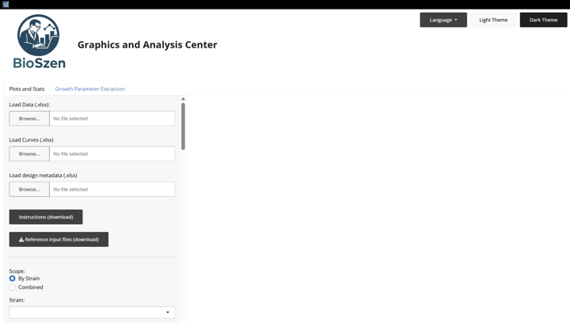
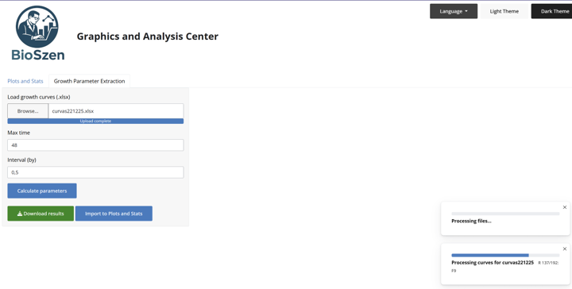

# BIOSZEN Quick Start (One-Page)

Fast onboarding guide for the **most common BIOSZEN workflows**.



> **IMPORTANT:**
> If you have raw plate data and curves, use **Platemap + Curves** mode for the most complete analysis.

## 1) Launch BIOSZEN

Run from the project root:

```bash
Rscript app.R
```

Or from R:

```r
BIOSZEN::run_app()
```

Then open the local URL shown in your console.

> **NOTE:**
> First run may install packages into `R_libs`. Keep that folder for faster next launches.

## 2) Flow A (Most Common): Full Analysis with Platemap + Curves

Use this when you have replicate-level data and well-based curves.

1. In **Load Data**, upload your platemap workbook (`Datos` + `PlotSettings`).
2. In **Load Curves**, upload your curves file (`Time` + well columns like `A1`, `A2`, ...).
3. Choose scope (`By Strain` or `Combined`) and select a plot type.
4. Apply filters (group/media/replicate).
5. Optionally enable **Normalize by control**.
6. Run statistics and significance annotations.
7. Export results (`PNG/PDF`, data tables, statistics, metadata, ZIP bundle).

## 3) Flow B: Parameter-Only Analysis (Grouped or Summary Inputs)

Use this when you do not have row-level raw replicate data.

1. In **Load Data**, upload grouped or summary workbook.
2. Select parameter(s) and plot type.
3. Apply filters and configure visuals.
4. Run the available statistical path for your input mode.
5. Export plot/data/metadata.

> **TIP:**
> In summary-only workflows, some normality/non-parametric routes can be limited.

## 4) Flow C: Growth Parameter Extraction

Use this when you want growth metrics such as `uMax`, `doub_time`, `lag_time`, and `AUC`.

1. Open the **Growth** tab.
2. Upload growth files (`.xlsx`).
3. Configure max time and interval.
4. Run extraction.
5. Download ZIP outputs and reuse them in the main plotting flow.



## 5) Fast Troubleshooting

- **Upload error**  
  Check this first: Required sheet and column names are present and exact.

- **Curves do not merge**  
  Check this first: `Well` values in platemap match curves column headers (`A1`, `A2`, ...).

- **No plot appears**  
  Check this first: Selected parameter/group still exists after filters.

- **Stats are disabled**  
  Check this first: Your selected test is supported by the current input mode.

## 6) Useful References

- Full README: `README.md`
- English manual: `inst/app/www/MANUAL_EN.md`
- Spanish manual: `inst/app/www/MANUAL_ES.md`
- Templates: `inst/app/www/reference_files/`
- [Ejemplo_platemap_parametros.xlsx](../inst/app/www/reference_files/Ejemplo_platemap_parametros.xlsx)
- [Ejemplo_curvas.xlsx](../inst/app/www/reference_files/Ejemplo_curvas.xlsx)
- [Ejemplo_parametros_agrupados.xlsx](../inst/app/www/reference_files/Ejemplo_parametros_agrupados.xlsx)
- [Ejemplo_input_summary_mean_sd.xlsx](../inst/app/www/reference_files/Ejemplo_input_summary_mean_sd.xlsx)


