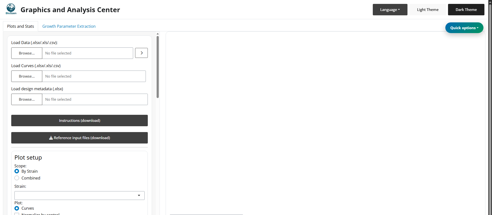
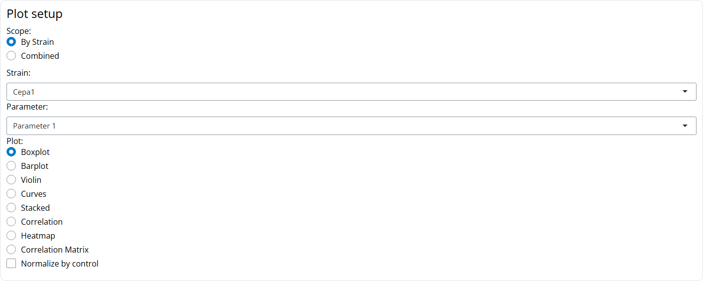
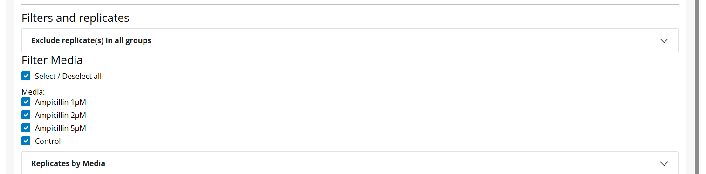
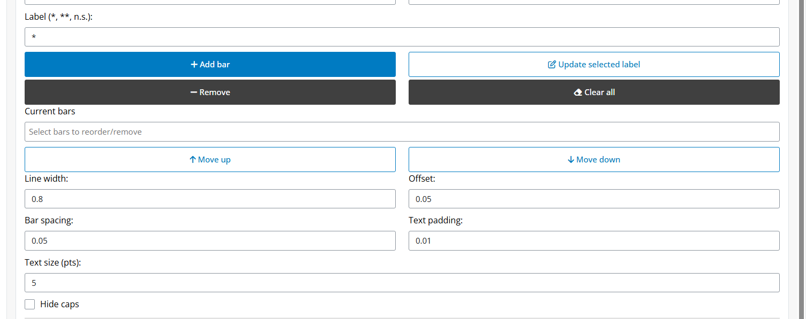
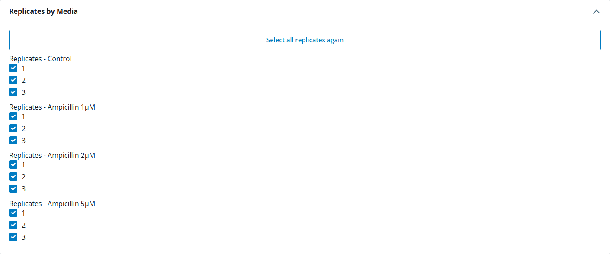
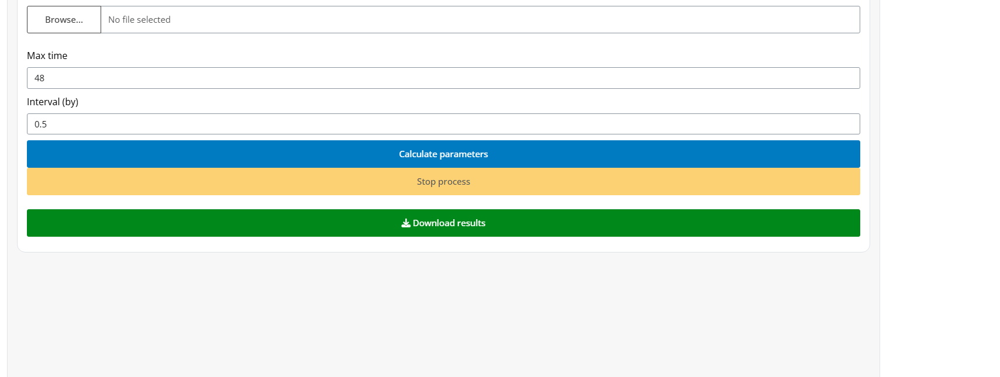

# BIOSZEN User Manual (English)

A practical guide to run BIOSZEN from raw files to reproducible outputs.

> **IMPORTANT:**
> If possible, use **Platemap + Curves** mode. It gives the best support for statistics, replicate QC, and complete exports.

> **TIP:**
> Keep this manual open while working. Each section includes both quick actions and deeper technical reference.

## Manual Map

- [1. Before You Start](#1-before-you-start)
- [2. Fast Start by Scenario](#2-fast-start-by-scenario)
- [3. Choose an Input Mode](#3-choose-an-input-mode)
- [4. Input Specifications](#4-input-specifications)
- [5. Standard Workflow](#5-standard-workflow)
- [6. Plot Types and Controls](#6-plot-types-and-controls)
- [7. Normalization](#7-normalization)
- [8. Statistics](#8-statistics)
- [9. Significance Annotations](#9-significance-annotations)
- [10. QC and Replicate Management](#10-qc-and-replicate-management)
- [11. Metadata and Reproducibility](#11-metadata-and-reproducibility)
- [12. Downloads](#12-downloads)
- [13. Growth Module](#13-growth-module)
- [14. Troubleshooting Playbook](#14-troubleshooting-playbook)
- [15. Support](#15-support)

## 1. Before You Start

Requirements:

- R >= 4.1.
- BIOSZEN launched from `app.R` or `BIOSZEN::run_app()`.
- Data file for **Load Data** in `Excel` (`.xlsx`, `.xls`) or `CSV` (`.csv`).
- Curves file for **Load Curves** in `Excel` (`.xlsx`, `.xls`) or `CSV` (`.csv`) when curves are not embedded in the main workbook.

Reference templates available in-app (**Reference input files (download)**) and in:

- `inst/app/www/reference_files/`

Template files:

- [Ejemplo_platemap_parametros.xlsx](reference_files/Ejemplo_platemap_parametros.xlsx)
- [Ejemplo_curvas.xlsx](reference_files/Ejemplo_curvas.xlsx)
- [Ejemplo_parametros_agrupados.xlsx](reference_files/Ejemplo_parametros_agrupados.xlsx)
- [Ejemplo_input_summary_mean_sd.xlsx](reference_files/Ejemplo_input_summary_mean_sd.xlsx)

> **NOTE:**
> First launch may install packages into local `R_libs`. Keep that folder to avoid reinstalling dependencies.

## 2. Fast Start by Scenario

### Scenario A: I have raw plate data and curves (recommended)

1. Load platemap in **Load Data**.
2. Load curves file in **Load Curves**.
3. Select scope and plot type.
4. Apply filters and replicate QC.
5. Run stats and annotations.
6. Export plot, tables, metadata, and ZIP bundle.

### Scenario B: I only have grouped or summary data

1. Load grouped/summary workbook in **Load Data**.
2. Configure plots and filters.
3. Run available stats for that mode.
4. Export plots and metadata.

### Scenario C: I need performance on larger datasets

1. Start with `.csv` in **Load Data**.
2. Keep selected parameters small while iterating.
3. Add overlays/advanced layers only near final export.

## 3. Choose an Input Mode

- **Platemap + Curves**  
  Best when: You want full workflow depth.  
  Main limitations: Requires strict well mapping and sheet structure.

- **Grouped parameters**  
  Best when: Parameter-only analysis.  
  Main limitations: Curves require embedded `Curves_Summary`-type sheets (or a separate file in **Load Curves**).

- **Summary (Mean/SD/N)**  
  Best when: Raw replicate rows are unavailable.  
  Main limitations: Some normality/non-parametric routes may be limited.

- **CSV mode**  
  Best when: High-volume data and faster IO.  
  Main limitations: Metadata roundtrip still uses `.xlsx`.

## 4. Input Specifications

### 4.1 Platemap workbook

Required sheets:

- `Datos`: metadata + parameters.
- `PlotSettings`: default axis settings by parameter.

`Datos` expected columns:

- `Well`: well ID (`A1`, `B3`, etc.), required for curves linking.
- `Strain`: strain or biological group.
- `Media`: condition/treatment (`Control`, `Drug A`, etc.).
- `BiologicalReplicate`: biological replicate ID (`1`, `2`, `3`, ...).
- `TechnicalReplicate`: technical replicate within each biological replicate (`A`, `B`, `C` or `1`, `2`, `3`).
- `Replicate` (compatibility): legacy alternate biological replicate field.
- `Orden`: integer used for plotting/export ordering.
- Parameter columns: one or more numeric analytes/metrics.

Practical consistency rule:

- `Strain` + `Media` + `BiologicalReplicate` + `TechnicalReplicate` should identify each experimental row consistently.

`PlotSettings` expected columns:

- `Parameter`
- `Y_Max`
- `Interval`
- `Y_Title`

### 4.2 Curves file

Excel (`.xlsx`, `.xls`):

- `Sheet1`: first column `Time`, remaining columns by well (`A1`, `A2`, ...).
- `Sheet2`: `X_Max`, `Interval_X`, `Y_Max`, `Interval_Y`, `X_Title`, `Y_Title`.

CSV (`.csv`):

- First column `Time`, remaining columns by well (`A1`, `A2`, ...).
- Axis settings are auto-generated:
  - `X_Max` and `Y_Max`: observed maxima.
  - `Interval_X` and `Interval_Y`: `max/4`.
  - `X_Title` and `Y_Title`: blank by default.

> **WARNING:**
> Curves merge failures are usually caused by inconsistent well names between platemap and curves (`Well` vs curve headers).

### 4.3 Grouped parameters mode

- Load grouped workbook in **Load Data**.
- Designed for parameter plots/statistics from grouped sheets (for example `Parametro_1`, `Parametro_2`, ...).
- Optional embedded curves are supported via summary-curve sheets in the same workbook.
- Keep using **Load Data** for grouped workbooks (do not upload grouped files in **Load Curves**).

### 4.4 Summary mode

- Load summary workbook in **Load Data**.
- BIOSZEN detects parameter summaries from any of these sheet names:
  - `Parameters_Summary`
  - `Parametros_Summary`
  - `Summary_Parameters`
  - `Resumen_Parametros`
- BIOSZEN detects embedded curve summaries from any of these sheet names:
  - `Curves_Summary`
  - `Curvas_Summary`
  - `Summary_Curves`
  - `Resumen_Curvas`
- Useful when row-level raw replicates are unavailable.
- Curves plots require either a valid **Load Curves** file or an embedded curve-summary sheet.

### 4.5 CSV mode

- **Load Data** accepts `.csv` and auto-detects delimiter (`,`, `;`, tab, `|`).
- BIOSZEN attempts profile conversion when CSV is not already platemap-ready.
- **Load Curves** also accepts `.csv` (`Time` + wells).

## 5. Standard Workflow

1. Load main data file.
2. Optionally load/merge curves.
3. Optionally load metadata.
4. Choose scope (`By Strain` or `Combined`).
5. Select plot type.
6. Apply filters and replicate selections.
7. Optionally normalize by control.
8. Run statistics.
9. Add significance annotations.
10. Export outputs.

## 6. Plot Types and Controls

### Boxplot

- Best for raw replicate distributions.
- Controls: jitter, box width, point size.
- Supports manual/automatic significance annotations.
- `Flip orientation (horizontal)` improves readability for long group labels.

### Barplot

- Best for summarized group comparisons.
- Supports error bars and optional raw points.
- Horizontal orientation available.

### Violin

- Best for showing distribution shape with replicate overlays.
- Uses the same annotation workflow as Boxplot/Barplot.
- Horizontal orientation available.

### Stacked

- Parameter selector + parameter ordering controls.
- Configurable deviation bars and color behavior.
- Annotation labels/brackets available.
- Horizontal orientation available.

### Correlation

- Select X/Y parameters.
- Methods: Pearson, Spearman, Kendall.
- Optional overlays: regression line, `r`, `p`, `R2`, equation.
- Advanced panel supports one-vs-all style screening and Excel export.

### Heatmap

- Parameter subset selection.
- Scale options: none, row, column.
- Optional clustering and dendrograms.
- Optional in-cell value labels.

### Correlation Matrix

- Multi-select parameters.
- Correlation method + p-value correction.
- Optional significant labels only.

### Curves

- Configure axes, labels, line width.
- Choose line geometry and confidence interval style.
- Optional raw replicate trajectories.

### Composition Panel

Recommended steps:

1. Click **Add to panel** from individual plots.
2. Open **Composition Panel** tab.
3. Select and order plots.
4. Configure layout (rows/columns, grid, output size).
5. Configure style (legend, fonts, text sizes, palette).
6. Optionally add rich text and per-plot overrides.
7. Export to `PNG`, `PPTX`, `PDF`.

## 7. Normalization

Enable **Normalize by control** and pick a control medium.

- BIOSZEN creates normalized columns with `_Norm` suffix.
- Correlation supports axis-specific normalization (`both`, `X only`, `Y only`).
- Fallback logic is applied when strict control pairing is not available.

## 8. Statistics

### Main statistical tools

- Shapiro-Wilk: `stats::shapiro.test`
- Kolmogorov-Smirnov: `stats::ks.test`
- Anderson-Darling: `nortest::ad.test`
- ANOVA: `stats::aov`
- Kruskal-Wallis: `stats::kruskal.test`
- t-test routes: `rstatix::t_test`, `rstatix::pairwise_t_test`
- Wilcoxon routes: `rstatix::wilcox_test`
- Multiple-testing correction: `stats::p.adjust`

Post hoc routes by selection:

- Tukey / Games-Howell: `rstatix`
- Dunn: `rstatix::dunn_test`
- Dunnett: `DescTools::DunnettTest`
- Scheffe, Conover, Nemenyi, DSCF: `PMCMRplus`

Curve statistics (`S1`-`S4`):

- `S1`: `stats::lm` + `splines::ns` + `stats::anova`
- `S2`: `stats::pnorm` + `stats::pchisq`
- `S3`: `stats::pnorm`
- `S4`: `gcplyr::auc` + normality-driven comparisons (`stats::t.test`, `stats::wilcox.test`, `stats::aov`, `stats::kruskal.test`)

Comparison modes:

- All vs all
- Control vs all
- Pair

P-value correction options:

- Holm
- FDR
- Bonferroni
- None

> **CAUTION:**
> In Summary mode, normality may be `NA` and some non-parametric paths that require raw observations are disabled.

## 9. Significance Annotations

Manual workflow:

1. Select Group 1 and Group 2.
2. Enter label (`*`, `**`, `***`, `ns`, custom text).
3. Add/reorder/edit/remove annotations.

Automatic workflow:

1. Run significance tests.
2. Open auto-annotation options.
3. Choose inclusion (`significant only` or `all`).
4. Choose label mode (`stars` or `p-value`).
5. Replace or append annotations.

## 10. QC and Replicate Management

Use QC panels to monitor:

- Missing values.
- Outliers by group.
- Sample size and replicate coverage.

### Biological replicates

- Manual include/exclude controls.
- Automatic IQR filtering.
- Keep-N reproducibility selection.

Keep-N behavior:

- Ranks replicates by distance to the group median across selected parameters.
- Keeps lowest-score (most reproducible) replicates.

### Technical replicates

Available when technical replicates are valid:

- Dedicated technical QC tab.
- Group and biological-replicate selectors.
- Global select/deselect controls.
- Automatic IQR technical outlier detection.
- Technical Keep-N per subgroup.

## 11. Metadata and Reproducibility

Metadata flow:

- **Download metadata** to save current state.
- Re-import metadata in future sessions.
- Orientation flip state persists across metadata roundtrip.

Reproducibility bundle:

- Save plot versions in-session.
- Export ZIP with plot assets + metadata.
- Reopen workflows with consistent configuration.

Regression coverage includes:

- Orientation flip applied only to Boxplot/Barplot/Violin/Stacked.
- Metadata roundtrip persistence checks.
- Final builder orientation checks.

## 12. Downloads

Main outputs:

- Plot image (`PNG`, `PDF`, depending on chart).
- Data export.
- Metadata export.
- Statistics export.
- Bundle ZIP.
- Advanced correlation tables.
- Merged platemap/curves exports (if merge tools were used).

## 13. Growth Module

Growth tab file support:

- Accepted file type: `Excel` (`.xlsx`).
- Auto-detected structures:
  - Reader/Tecan-like raw layout (typically later-row data in `Sheet1`).
  - Processed `A1` table layout (first column time, following columns as wells/curves).

Extracted parameters:

- `uMax`: maximum exponential-phase slope.
- `max_percap_time`: time window of max per-capita growth.
- `doub_time`: doubling time (`ln(2) / uMax`).
- `lag_time`: pre-exponential transition time.
- `ODmax`: maximum measured OD/signal.
- `max_time`: time at `ODmax`.
- `AUC`: area under the curve.

Typical flow:

1. Upload one or more growth files.
2. Set max time and interval.
3. Run extraction.
4. Download ZIP outputs.
5. Reuse extracted outputs in main plotting workflows.

## 14. Troubleshooting Playbook

- **Upload error**  
  Likely cause: Missing sheet/column names.  
  What to do: Validate workbook structure and exact headers.

- **No plot generated**  
  Likely cause: Selected parameter/group absent after filtering.  
  What to do: Reset filters and verify parameter availability.

- **Only Curves appears in plot type selector**  
  Likely cause: No valid parameter columns were parsed from the uploaded data file.  
  What to do: Verify grouped/summary sheet structure and parameter headers, then re-upload.

- **Normalization unavailable**  
  Likely cause: Missing control medium in current scope.  
  What to do: Confirm control group exists in active subset.

- **Stats disabled**  
  Likely cause: Mode/test mismatch.  
  What to do: Switch test or use a mode with raw-compatible data.

- **Curves merge fails**  
  Likely cause: Well ID mismatch.  
  What to do: Match platemap `Well` values to curves columns.

- **Grouped/Summary workbook loads but Curves has no data**  
  Likely cause: Missing embedded curves summary sheet.  
  What to do: Add `Curves_Summary` (or alias) to the workbook, or upload curves separately in **Load Curves**.

- **CSV not recognized**  
  Likely cause: Wrong delimiter or missing required headers.  
  What to do: Check delimiter consistency and required columns.

- **Slow performance**  
  Likely cause: Too many parameters/overlays at once.  
  What to do: Reduce active parameters and heavy layers.

## 15. Support

For support and bug reports: `bioszenf@gmail.com`

