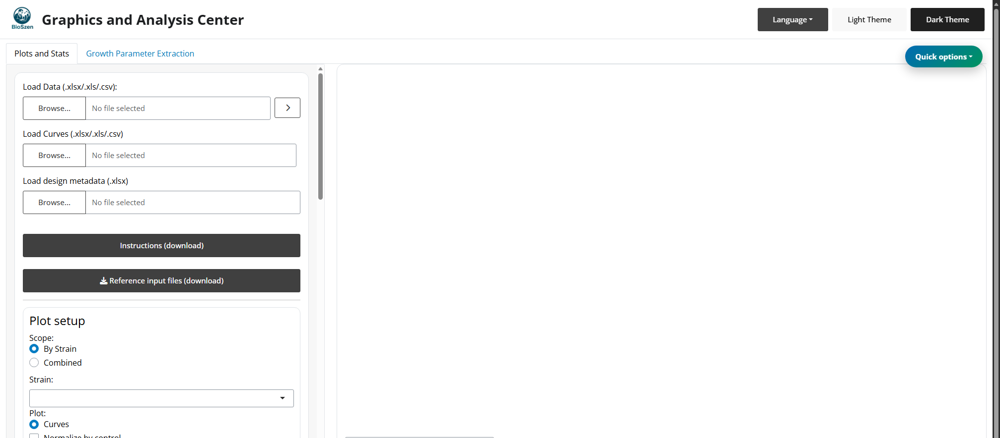
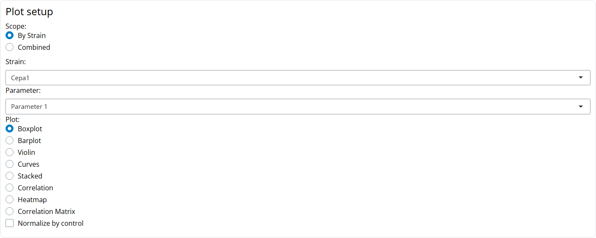
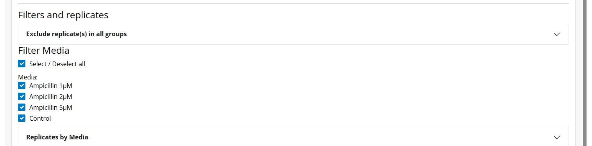
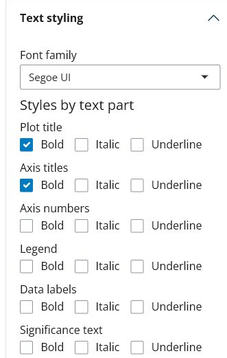
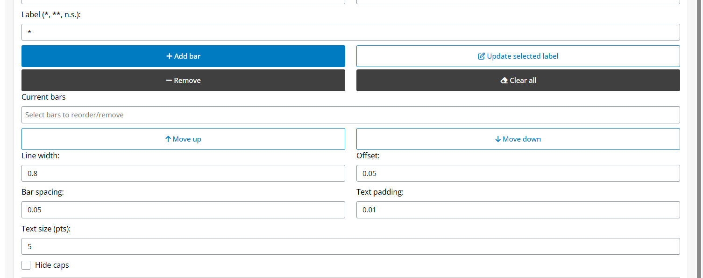
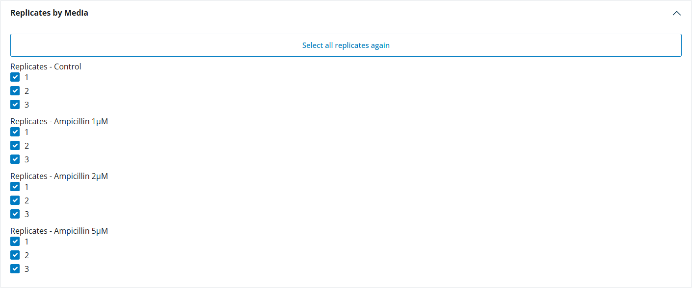
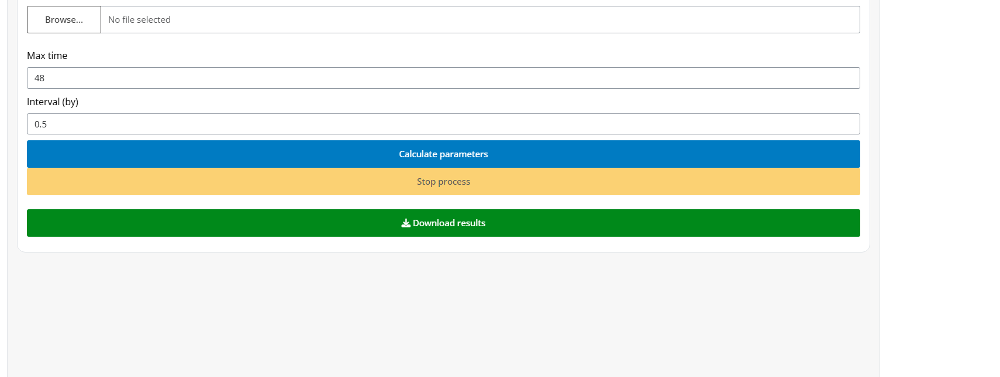

# BIOSZEN User Manual (English)

A practical guide to run BIOSZEN from raw files to reproducible outputs.



> **IMPORTANT:**
> If possible, use **Platemap + Curves** mode. It gives the best support for statistics, replicate QC, and complete exports.

> **TIP:**
> Keep this manual open while working. Each section includes both quick actions and deeper technical reference.

## Manual Map

- [1. Before You Start](#1-before-you-start)
- [2. Fast Start by Scenario](#2-fast-start-by-scenario)
- [3. Choose an Input Mode](#3-choose-an-input-mode)
- [4. Input Specifications](#4-input-specifications)
- [5. Standard Workflow](#5-standard-workflow)
- [6. Plot Types and Controls](#6-plot-types-and-controls)
- [7. Normalization](#7-normalization)
- [8. Statistics](#8-statistics)
- [9. Significance Annotations](#9-significance-annotations)
- [10. QC and Replicate Management](#10-qc-and-replicate-management)
- [11. Metadata and Reproducibility](#11-metadata-and-reproducibility)
- [12. Downloads](#12-downloads)
- [13. Growth Module](#13-growth-module)
- [14. Troubleshooting Playbook](#14-troubleshooting-playbook)
- [15. Support](#15-support)

## 1. Before You Start

Requirements:

- R >= 4.1.
- BIOSZEN launched from `app.R`, `BIOSZEN::BIOSZEN()`, or `BIOSZEN::run_app()`.
- Data file for **Load Data** in `Excel` (`.xlsx`, `.xls`) or `CSV` (`.csv`).
- Curves file for **Load Curves** in `Excel` (`.xlsx`, `.xls`) or `CSV` (`.csv`) when curves are not embedded in the main workbook.

Install the stable R package from R-universe with:

```r
install.packages(
  "BIOSZEN",
  repos = c(
    "https://bioszen.r-universe.dev",
    "https://cloud.r-project.org"
  )
)
BIOSZEN::BIOSZEN()
```

The package launcher opens the operating system's configured default browser.
Use `BIOSZEN::BIOSZEN(app_window = TRUE)` to request a dedicated app-style
Chromium window. The RStudio Addin is installed and registered automatically
with BIOSZEN; no Addin files need to be copied manually. Restart RStudio after
installing or updating BIOSZEN, then use **Addins > Launch BIOSZEN in Browser**
to start it without typing a command. An optional shortcut can be assigned from
**Addins > Browse Addins > Keyboard Shortcuts**. Pass `launch.browser = FALSE`
only when automatic browser opening is not desired.

The standalone `App.R` and bundle launch methods remain available for users who
prefer not to install BIOSZEN from a package repository.

Reference templates available in-app (**Reference input files (download)**) and in:

- `inst/app/www/reference_files/`

Template files:

- [Ejemplo_platemap_parametros.xlsx](reference_files/Ejemplo_platemap_parametros.xlsx)
- [Ejemplo_curvas.xlsx](reference_files/Ejemplo_curvas.xlsx)
- [Ejemplo_parametros_agrupados.xlsx](reference_files/Ejemplo_parametros_agrupados.xlsx)
- [Ejemplo_input_summary_mean_sd.xlsx](reference_files/Ejemplo_input_summary_mean_sd.xlsx)

> **NOTE:**
> First launch may install packages into local `R_libs`. Keep that folder to avoid reinstalling dependencies.

## 2. Fast Start by Scenario

### Scenario A: I have raw plate data and curves (recommended)

1. Load platemap in **Load Data**.
2. Load curves file in **Load Curves**.
3. Select scope and plot type.
4. Apply filters and replicate QC.
5. Run stats and annotations.
6. Export plot, tables, metadata, and ZIP bundle.

### Scenario B: I only have grouped or summary data

1. Load grouped/summary workbook in **Load Data**.
2. Configure plots and filters.
3. Run available stats for that mode.
4. Export plots and metadata.

### Scenario C: I need performance on larger datasets

1. Start with `.csv` in **Load Data**.
2. Keep selected parameters small while iterating.
3. Add overlays/advanced layers only near final export.

### Scenario D: I need a reproducible R script

- Launch the same app with `BIOSZEN::BIOSZEN()`; `BIOSZEN::run_app()` remains supported.
- In RStudio, the automatically installed **Addins > Launch BIOSZEN in Browser** command provides a one-click equivalent and opens the operating system's configured default browser.
- Use `BIOSZEN::growth_parameters()` to obtain the same growth parameters as the Growth tab without opening the visual interface.
- `growth_parameters()` accepts wide/tidy data frames, one or more `.xlsx`/`.xls`/`.csv` files, or a directory. It writes nothing unless `output_dir` is supplied.
- Use `BIOSZEN::bioszen_update_available()` to check for an update and `BIOSZEN::bioszen_update()` to install one after confirmation and after closing the app.
- When BIOSZEN is launched as an installed R package, the blue **Update** button keeps the same update workflow: it reports when no newer stable release exists and otherwise shows both versions before requesting confirmation.
- When BIOSZEN is launched from the local standalone bundle, the button changes to **Install package**. After confirmation, BIOSZEN closes and installs the stable R-universe package in the personal R library. Restart R and then use `BIOSZEN::BIOSZEN()`. If a normal package installation already exists, BIOSZEN reports it instead of installing again.
- **Installation and update safety:** neither action installs silently. Save or download unsaved work before confirming. BIOSZEN closes Shiny before modifying package files, and the checks do not send uploaded experimental data, personal information, or credentials. If a download is interrupted or the R library is locked, the standalone launcher remains usable; restart R and retry or run `BIOSZEN::bioszen_update()` for an existing package installation.
- Use `BIOSZEN::bioszen_citation()` or `citation("BIOSZEN")` for the official citation.



## 3. Choose an Input Mode

- **Platemap + Curves**  
  Best when: You want full workflow depth.  
  Main limitations: Requires strict well mapping and sheet structure.

- **Grouped parameters**  
  Best when: Parameter-only analysis.  
  Main limitations: Curves require embedded `Curves_Summary`-type sheets (or a separate file in **Load Curves**).

- **Summary (Mean/SD/N)**  
  Best when: Raw replicate rows are unavailable.  
  Main limitations: Some normality/non-parametric routes may be limited.

- **CSV mode**  
  Best when: High-volume data and faster IO.  
  Main limitations: Metadata roundtrip still uses `.xlsx`.

## 4. Input Specifications

### 4.1 Platemap workbook

Required sheets:

- `Datos`: metadata + parameters.
- `PlotSettings`: default axis settings by parameter.

`Datos` expected columns:

- `Well`: well ID (`A1`, `B3`, etc.), required for curves linking.
- `Strain`: strain or biological group.
- `Media`: condition/treatment (`Control`, `Drug A`, etc.).
- `BiologicalReplicate`: biological replicate ID (`1`, `2`, `3`, ...).
- `TechnicalReplicate`: technical replicate within each biological replicate (`A`, `B`, `C` or `1`, `2`, `3`).
- `Replicate` (compatibility): legacy alternate biological replicate field.
- `Orden`: integer used for plotting/export ordering.
- Parameter columns: one or more numeric analytes/metrics.

Practical consistency rule:

- `Strain` + `Media` + `BiologicalReplicate` + `TechnicalReplicate` should identify each experimental row consistently.

`PlotSettings` expected columns:

- `Parameter`
- `Y_Max`
- `Interval`
- `Y_Title`

### 4.2 Curves file

Excel (`.xlsx`, `.xls`):

- `Sheet1`: first column `Time`, remaining columns by well (`A1`, `A2`, ...).
- `Sheet2`: `X_Max`, `Interval_X`, `Y_Max`, `Interval_Y`, `X_Title`, `Y_Title`.

CSV (`.csv`):

- First column `Time`, remaining columns by well (`A1`, `A2`, ...).
- Axis settings are auto-generated:
  - `X_Max` and `Y_Max`: observed maxima.
  - `Interval_X` and `Interval_Y`: `max/4`.
  - `X_Title` and `Y_Title`: blank by default.

> **WARNING:**
> Curves merge failures are usually caused by inconsistent well names between platemap and curves (`Well` vs curve headers).

### 4.3 Grouped parameters mode

- Load grouped workbook in **Load Data**.
- Designed for parameter plots/statistics from grouped sheets (for example `Parametro_1`, `Parametro_2`, ...).
- Optional embedded curves are supported via summary-curve sheets in the same workbook.
- Keep using **Load Data** for grouped workbooks (do not upload grouped files in **Load Curves**).

### 4.4 Summary mode

- Load summary workbook in **Load Data**.
- BIOSZEN detects parameter summaries from any of these sheet names:
  - `Parameters_Summary`
  - `Parametros_Summary`
  - `Summary_Parameters`
  - `Resumen_Parametros`
- BIOSZEN detects embedded curve summaries from any of these sheet names:
  - `Curves_Summary`
  - `Curvas_Summary`
  - `Summary_Curves`
  - `Resumen_Curvas`
- Useful when row-level raw replicates are unavailable.
- Curves plots require either a valid **Load Curves** file or an embedded curve-summary sheet.

### 4.5 CSV mode

- **Load Data** accepts `.csv` and auto-detects delimiter (`,`, `;`, tab, `|`).
- BIOSZEN attempts profile conversion when CSV is not already platemap-ready.
- **Load Curves** also accepts `.csv` (`Time` + wells).

### 4.6 Optional AI skill for input preparation

The GitHub/source repository includes an optional AI-agent skill in the
[`skills/bioszen-platemap-curves/` GitHub folder](https://github.com/bioszen/BIOSZEN/tree/main/skills/bioszen-platemap-curves).
To use it, give that GitHub folder URL to the corresponding AI tool or agent so
it can read or acquire the skill. If the agent needs local files, download the
repository ZIP from
<https://github.com/bioszen/BIOSZEN/archive/refs/heads/main.zip> and copy the
`skills/bioszen-platemap-curves/` folder into your agent's skill system.

Use this skill from Codex, Claude, Antigravity, or similar agentic tools when
you need to generate a `Datos` + `PlotSettings` platemap from any readable data
file, correct an existing platemap, repair parameter-name typing mistakes
between `Datos` columns and `PlotSettings$Parameter`, prepare a separate curves
workbook, or validate that `Datos$Well` exactly matches curve headers before
uploading files to BIOSZEN.

The skill is a documentation/tooling extra. It does not modify the BIOSZEN app
and does not assume fixed parameter names, fixed experiment labels, or a
specific measurement type.

## 5. Standard Workflow

1. Load main data file.
2. Optionally load/merge curves.
3. Optionally load metadata.
4. Choose scope (`By Strain` or `Combined`).
5. Select plot type.
6. Apply filters and replicate selections.
7. Optionally normalize by control.
8. Run statistics.
9. Add significance annotations.
10. Export outputs.



## 6. Plot Types and Controls

### Boxplot

- Best for raw replicate distributions.
- Controls: jitter, box width, point size.
- Supports manual/automatic significance annotations.
- `Flip orientation (horizontal)` improves readability for long group labels.

### Barplot

- Best for summarized group comparisons.
- Supports error bars and optional raw points.
- Horizontal orientation available.

### Violin

- Best for showing distribution shape with replicate overlays.
- Uses the same annotation workflow as Boxplot/Barplot.
- Horizontal orientation available.

### Stacked

- Parameter selector + parameter ordering controls.
- Configurable deviation bars and color behavior.
- Statistics and auto-generated significance are available per included parameter. Comparisons are made within each parameter, so `Parameter A - Group 1` is compared with `Parameter A - Group 2`, not with another stacked segment.
- Significance labels can be added over the selected target group for the selected parameter; the results table includes a `Parameter` column.
- Annotation labels are recommended for stacked plots.
- Horizontal orientation available; legends, text styles, error bars, and significance labels are preserved when the plot is flipped.

### Correlation

- Select X/Y parameters.
- Methods: Pearson, Spearman, Kendall.
- Optional overlays: regression line, `r`, `p`, `R2`, equation.
- Advanced panel supports one-vs-all style screening and Excel export.

### Concentration-response / dose-response

- Select the response parameter, compound series, strains, biological replicates, and displayed conditions to include. The same group and replicate filters used by the other plots remain active.
- BIOSZEN reads recognized concentrations from condition names and lets you correct every concentration and unit manually. All included rows must use one displayed unit before fitting.
- Each strain is fitted independently with a four-parameter log-logistic inhibitory model (`LL.4`). Individual biological-replicate points are shown by default; mean with SD or SEM is optional.
- The raw parameter or its control-normalized value can be used as the response. Normalized responses are fitted as percent of control.
- A lower IC50 indicates greater susceptibility only when the fit is inhibitory, the IC50 lies within the tested concentration range, and the uncertainty is acceptable. Values reported as `> maximum tested`, `< minimum tested`, or not estimable are excluded from susceptibility ranking.
- Axis limits, intervals, titles, fitted-line width, point size, black point outline, and confidence-band opacity affect presentation only. They do not refit the curve or change any parameter. An X interval is used on the linear axis; logarithmic X axes use automatic logarithmic spacing.

#### Interpretation of replicate and curve parameters

| Output | Interpretation |
|---|---|
| `Strain`, `Parameter`, `Compound`, `ConcentrationUnit` | Identify the fitted strain, selected response, treatment series, and concentration unit. Parameters from different response or concentration units should not be compared as if they were on the same scale. |
| `Condition`, `Concentration` | Original condition/group label and the corrected numeric concentration used for that row. Always verify the concentration mapping before fitting. |
| `BiologicalReplicate`, `TechnicalReplicate` | Replicate identifiers retained in the replicate-values sheet. Selected technical replicates are averaged within each biological replicate before nonlinear fitting; biological replicates are the independent model observations. |
| `RawValue` | Observed parameter value retained after the active group and replicate filters. |
| `NormalizedValue` | Observed value expressed as percent of the selected control when normalization is enabled. |
| `ModelValue` | Value actually supplied to the curve model: raw or normalized according to the selected mode. |
| `ResultBasis` | States which response parameter was used to calculate the reported IC50. |
| `IC50` / `IC50 result` | Concentration producing 50% of the fitted inhibitory effect relative to the upper fitted response. Lower values generally indicate greater susceptibility. Interpret only an IC50 estimable inside the tested range. |
| `ED50` | Relative 50% effective dose. In the current inhibitory `LL.4` implementation it is numerically the same fitted concentration as IC50. |
| `EC50` | Conventional half-maximal effective concentration field. It is reported as `NA` because the current BIOSZEN route fits an inhibitory IC50/ED50 model rather than a separate stimulatory EC50 model. |
| `IC50_SE` | Delta-method standard error of IC50. Larger values indicate less precise estimation. |
| `CI_Lower`, `CI_Upper` (95% CI lower/upper in the app) | Confidence interval for IC50. Wide intervals or limits extending far beyond the tested range indicate weak precision. |
| `HillSlope` | Shape parameter controlling transition steepness on the log-dose scale. For the decreasing inhibitory curves accepted by BIOSZEN it is positive; a larger value gives a sharper transition but is not by itself a susceptibility measure. |
| `LowerAsymptote` | Fitted response approached at high concentration. It is an extrapolated model limit and may differ from the lowest observed value. |
| `UpperAsymptote` | Fitted response approached at zero or low concentration. It is an extrapolated model limit and may differ from the highest observed value. |
| `ResponseRange` | `UpperAsymptote - LowerAsymptote`; the fitted response amplitude. |
| `InflectionPoint` | Concentration at the center of the fitted transition. For this model it normally coincides with the relative ED50/IC50. |
| `MaximumSlope` | Steepest fitted change on the raw concentration axis: `-(ResponseRange * HillSlope) / (4 * InflectionPoint)`. A more negative value means a faster local decrease but depends on both response and concentration units. |
| `MaximumSlopeMagnitude` | Absolute value of `MaximumSlope`, useful when comparing steepness without its negative inhibitory sign. Comparisons still require the same units. |
| `MinTested`, `MaxTested` | Lowest and highest positive concentrations included in the fitted series. They define whether IC50 is inside the experimental range. |
| `DoseLevels` | Number of distinct concentrations included, including zero when present. More well-spaced levels generally improve identifiability. |
| `BiologicalReplicates` | Number of distinct biological replicates contributing to the strain fit. |
| `Comparable` | `TRUE` only for a decreasing inhibitory fit with a finite positive IC50 inside the tested positive range. Only these rows enter ranking and pairwise IC50 tests. |
| `SusceptibilityRank` | Rank among comparable strains by ascending IC50. Rank 1 is the lowest IC50; it is descriptive unless supported by the adjusted pairwise comparison. |
| `RelativeToLowestIC50` | Strain IC50 divided by the lowest comparable IC50. The lowest strain equals 1; a value of 2 means twice the concentration was required for the same fitted 50% effect. |
| `Status` / `Fit status` | Reports whether the fit is usable or why it is not: insufficient doses, flat response, failed convergence, non-inhibitory response, IC50 not estimable, above range, or below range. |

#### Interpretation of model diagnostics and strain comparisons

| Output | Interpretation |
|---|---|
| `Model` | Model used for the strain; currently the four-parameter log-logistic model (`LL.4`). |
| `Observations` | Number of biological-replicate response values used in the fit after filtering and within-dose technical averaging. |
| `ResidualDF` | Residual degrees of freedom: observations minus the four fitted model parameters. |
| `RSS` | Residual sum of squares. Lower is better only when comparing fits to the same response and observations. |
| `RMSE` | Typical residual error in response units. Lower values indicate predictions closer to observations. |
| `R_Squared`, `Adjusted_R_Squared` | Descriptive proportion of response variation represented by the curve; adjusted R² accounts for four fitted parameters. For nonlinear models these should not be the sole acceptance criterion. |
| `AIC`, `BIC` | Information criteria for relative model comparison on the same dataset and response. Lower values are preferred; absolute values have no standalone biological interpretation. |
| `LogLikelihood` | Model log likelihood. Higher values indicate better likelihood fit only for comparable models fitted to the same observations. |
| `LinearSlope`, `LinearSlopeSE` | Optional slope and standard error from `Response ~ Concentration`. This is a coarse whole-range trend and does not replace IC50 or the nonlinear maximum slope. |
| `LinearSlopeCI_Lower`, `LinearSlopeCI_Upper` | Optional 95% confidence interval for the linear trend slope. An interval containing zero does not support a nonzero linear trend. |
| `LinearSlopeP_Value` | Optional test of whether the whole-range linear slope differs from zero. It does not test equality of IC50 values. |
| `Linear_R_Squared` | Descriptive R² for the optional linear trend. |
| `Converged` | Indicates whether the nonlinear fit object was successfully obtained. Convergence is necessary but does not guarantee biological plausibility or precision. |
| `StrainA`, `StrainB` | Identify the ordered strain pair used for the ratio and Wald comparison. |
| `IC50_Ratio_A_over_B` (IC50 ratio A/B in the app) | `IC50_A / IC50_B`. A ratio above 1 means strain A required a higher concentration and is descriptively less susceptible than B. |
| `Ratio_CI_Lower`, `Ratio_CI_Upper` | Delta-method 95% confidence interval for the IC50 ratio. An interval excluding 1 supports a difference before considering the multiplicity-adjusted test. |
| `P_Value`, `P_Adjusted` | Two-sided Wald test on the log IC50 ratio and its Holm correction across strain pairs. Use the adjusted value for the reported pairwise conclusion. |
| `LowerIC50Strain` | Identifies which member of the pair has the lower estimable IC50; this is the descriptively more susceptible strain when the fits are comparable. |
| `ConclusionCode` / `Interpretation` | Machine-readable conclusion (`different` or `not_significant`) and its plain-language app translation, based on the Holm-adjusted result. |

### Heatmap

- Parameter subset selection.
- Scale options: none, row, column.
- Optional clustering and dendrograms.
- Optional in-cell value labels.

### Correlation Matrix

- Multi-select parameters.
- Correlation method + p-value correction.
- Optional significant labels only.

### Curves

- Configure axes, labels, line width, and curve point size.
- Choose line geometry and confidence interval style.
- Optional raw replicate trajectories.
- **Curve point size** controls the visible markers when the line-and-points geometry is selected. It changes marker size only; curve values, line geometry, and statistical results are not altered.

### Shared plot appearance controls

- The **Error bar statistic** selector controls deviation bars where available:
  - `SD`: mean +/- standard deviation.
  - `SEM`: mean +/- standard error.
  - `Min-Max`: observed minimum to maximum; available only for Boxplot.
- The collapsible **Text styling** section is available for individual plots.
- **Font family** applies to all text in the current graph. Available choices include common publication and system fonts such as Helvetica, Arial, Calibri, Cambria, Segoe UI, Times New Roman, Georgia, Verdana, and related variants.
- Bold, italic, and underline are applied independently by text part: plot title, axis titles, axis tick labels, legend, data labels, and significance text.
- Axis-title styling is applied to both X and Y axis titles when those titles are visible. Axis tick-label styling applies to the labels shown along the axes, whether they are numeric ticks or category labels.
- Legend controls include whether the legend is shown on the right when applicable, plus legend text size and bold/italic/underline styling.
- Each text part can use its own combination of styles; selecting underline for significance text, for example, does not force underline on the title or legend.
- `Flip orientation (horizontal)`, when available, is a visual orientation change only. It preserves the same plotted values, legends, font family, bold/italic/underline settings, error bars, and significance annotations.
- These choices are applied to the plot preview and included in exported `PNG` and `PDF` files.



### Composition Panel

Recommended workflow:

1. Build and edit each source graph, then click **Add to panel**.
2. Open **Composition Panel** and use the plot picker to include, exclude, and order plots. Deselecting a plot removes it from the active composition without deleting the source graph.
3. Set rows and columns. For non-rectangular or repeated-cell layouts, enter the layout grid; column widths and row heights control relative sizing and positioning.
4. Set composition width and height in pixels. These values define the preview canvas and the composition aspect ratio; they are independent of export DPI and PowerPoint slide size.
5. Configure style, shared legends, typography, palette, rich text, and optional per-plot overrides. **Apply composition typography to every plot** changes tick-label sizes, X/Y angles and alignment, font family, and text styles across every included graph while preserving its data geometry.
6. Configure the PowerPoint slide preset (`4:3`, `16:9`, or custom), width, height, orientation, and edge margin.
7. Review the preview and export `PNG`, `PPTX`, `PDF`, or composition metadata.

#### DPI and physical dimensions

- The default export resolution is **300 DPI**. The supported range is **72 to 600 DPI**, and the value remains editable.
- DPI applies to raster output, including `PNG`, raster clipboard output, and the raster fallback used only when editable PowerPoint vector rendering is unavailable.
- `PDF` and the normal editable `PPTX` path are vector-based, so DPI does not alter their vector elements. A selected DPI is still stored in metadata for reproducibility and for any raster fallback.
- The browser preview uses screen/CSS pixel density. Changing export DPI does not resize or reposition the preview.
- Increasing DPI increases raster pixel count, rendering time, memory use, and file size. It does not change composition width/height, graph proportions, layout positions, or PowerPoint slide dimensions.
- Composition width/height control the logical canvas. PowerPoint width/height control the physical slide. DPI controls raster sampling quality. These are separate settings.
- Metadata stores the effective DPI and restores it when loaded. Legacy metadata without a DPI field uses 300 DPI. Missing, non-numeric, zero, negative, or out-of-range DPI values safely fall back to 300 DPI; other valid metadata fields are still restored.

Composition style controls apply in parallel to all selected plots. The composition **Text styling** section mirrors the individual plot controls: the font family is applied across all plot text, while bold/italic/underline can be selected separately for titles, axes, legends, data labels, and significance text. Composition metadata also preserves layout, dimensions, slide settings, DPI, typography, legend configuration, palette, rich text, and per-plot overrides.

The PowerPoint export always creates one slide and proportionally fits the preview layout within the selected margins. If a slide is too small, BIOSZEN scales the composition down and warns the user rather than overlapping or clipping plots. Very dense layouts, long labels, large fonts, and small portrait slides may require a larger slide, fewer plots, shorter labels, or wider margins. Preview and PowerPoint text can differ slightly because browser and PowerPoint font metrics are not identical; BIOSZEN applies a proportional safety adjustment when shrinking the layout.



## 7. Normalization

Enable **Normalize by control** and pick a control medium.

- BIOSZEN creates normalized columns with `_Norm` suffix.
- Correlation supports axis-specific normalization (`both`, `X only`, `Y only`).
- Fallback logic is applied when strict control pairing is not available.

## 8. Statistics

### Main statistical tools

- Shapiro-Wilk: `stats::shapiro.test`
- Kolmogorov-Smirnov: `stats::ks.test`
- Anderson-Darling: `nortest::ad.test`
- ANOVA: `stats::aov`
- Kruskal-Wallis: `stats::kruskal.test`
- t-test routes: `rstatix::t_test`, `rstatix::pairwise_t_test`
- Wilcoxon routes: `rstatix::wilcox_test`
- Multiple-testing correction: `stats::p.adjust`

Post hoc routes by selection:

- Tukey / Games-Howell: `rstatix`
- Dunn: `rstatix::dunn_test`
- Dunnett: `DescTools::DunnettTest`
- Scheffe, Conover, Nemenyi, DSCF: `PMCMRplus`

Curve statistics (`S1`-`S4`):

The **Curve Statistics** accordion appears for Curves plots. Select one or more methods, then click **Run curve statistics** to generate the results table.

- `S1`: `stats::lm` + `splines::ns` + `stats::anova`
- `S2`: `stats::pnorm` + `stats::pchisq`
- `S3`: `stats::pnorm`
- `S4`: `gcplyr::auc` + normality-driven comparisons (`stats::t.test`, `stats::wilcox.test`, `stats::aov`, `stats::kruskal.test`)

Comparison modes:

- All vs all
- Control vs all
- Pair

P-value correction options:

- Holm
- FDR
- Bonferroni
- None

For **Stacked** plots, normality and significance are calculated separately for each included parameter. The output table includes `Parameter`, and each parameter-level comparison should match the same comparison run from the corresponding single-parameter plot.

> **CAUTION:**
> In Summary mode, normality may be `NA` and some non-parametric paths that require raw observations are disabled.

## 9. Significance Annotations

Manual workflow:

1. Select Group 1 and Group 2.
2. Enter label (`*`, `**`, `***`, `ns`, custom text).
3. Add/reorder/edit/remove annotations.

Automatic workflow:

1. Run significance tests.
2. Open auto-annotation options.
3. Choose inclusion (`significant only` or `all`).
4. Choose label mode (`stars` or `p-value`).
5. Replace or append annotations.

For **Stacked** plots, choose the parameter before adding a label. Automatic labels keep the parameter identity and place the annotation over the selected target group for that parameter.

## 10. QC and Replicate Management

Use QC panels to monitor:

- Missing values.
- Outliers by group.
- Sample size and replicate coverage.

### Biological replicates

- Manual include/exclude controls.
- Automatic IQR filtering.
- Keep-N reproducibility selection.

Keep-N behavior:

- Ranks replicates by distance to the group median across selected parameters.
- Keeps lowest-score (most reproducible) replicates.

### Technical replicates

Available when technical replicates are valid:

- Dedicated technical QC tab.
- Group and biological-replicate selectors.
- Global select/deselect controls.
- Automatic IQR technical outlier detection.
- Technical Keep-N per subgroup.



## 11. Metadata and Reproducibility

Metadata flow:

- **Download metadata** to save current state.
- Re-import metadata in future sessions.
- Orientation flip state persists across metadata roundtrip.
- Plot typography choices persist across metadata roundtrip, including font family, text sizes, and normal/bold/italic/underline state for plot titles, X/Y axis titles, axis tick labels, legend text, data labels, and significance text.
- Legend visibility/placement, including right-side legend selection where applicable, is stored in metadata and reapplied when metadata are loaded.
- Curve point size is stored in curve design metadata and restored when that metadata is loaded. Design metadata do not restore group/sample order, scope, or strain selection.
- Error-bar statistic and curve-statistics method selection persist across metadata roundtrip.
- Dose-response series and strain selections, corrected concentration mapping, axis limits and intervals, axis titles, line and point sizes, point outline, and confidence-band opacity persist in dose-response metadata and saved plot versions.

Reproducibility bundle:

- Save plot versions in-session.
- Export ZIP with plot assets + metadata.
- Reopen workflows with consistent configuration.

Regression coverage includes:

- Orientation flip applied only to Boxplot/Barplot/Violin/Stacked.
- Metadata roundtrip persistence checks.
- Final builder orientation checks.

## 12. Downloads

Main outputs:

- Plot image (`PNG`, `PDF`, depending on chart).
- Data export.
- Metadata export.
- Statistics export.
- Bundle ZIP.
- Advanced correlation tables.
- Merged platemap/curves exports (if merge tools were used).

Plot exports preserve the active visual configuration, including font family, per-text-part bold/italic/underline choices, selected error-bar statistic, significance labels, and axis/legend settings. Composition exports preserve the same typography controls across all plots in the layout.

Raster exports use **300 DPI by default** and accept supported user values from 72 to 600 DPI. The selected effective DPI is included in metadata and bundle versions. Vector PDF/PPTX elements do not use DPI; graph width, height, and slide dimensions are configured separately.

## 13. Growth Module

Growth tab file support:

- Accepted file type: `Excel` (`.xlsx`).
- Auto-detected structures:
  - Reader/Tecan-like raw layout (typically later-row data in `Sheet1`).
  - Processed `A1` table layout (first column time, following columns as wells/curves).

Extracted parameters:

- `uMax`: maximum exponential-phase slope.
- `max_percap_time`: time window of max per-capita growth.
- `doub_time`: doubling time (`ln(2) / uMax`).
- `lag_time`: pre-exponential transition time.
- `ODmax`: maximum measured OD/signal.
- `max_time`: time at `ODmax`.
- `AUC`: area under the curve.
- `OD0`: initial OD/signal at the first measured point of each curve.

Typical flow:

1. Upload one or more growth files.
2. Set max time and interval.
3. Run extraction.
4. Download ZIP outputs.
5. Reuse extracted outputs in main plotting workflows.

Autosave and interruption handling:

- The optional **Autosave output folder** can be typed manually or selected with **Browse...**.
- If you do not want autosave, leave this folder blank and download the ZIP with **Download results** at the end.
- If you type a folder, it must already exist. If the path does not exist, BIOSZEN shows a correction message and does not start that run until the path is fixed or cleared.
- When an autosave folder is set, final `Curves_*.xlsx` / `Parameters_*.xlsx` files are copied there automatically while the regular **Download results** ZIP remains available.
- During long runs, BIOSZEN writes per-well checkpoints under a temporary `BIOSZEN_growth_checkpoints` folder inside the selected autosave folder. These checkpoints allow an interrupted run to resume from completed wells instead of starting from zero.
- Checkpoints are deleted automatically after a successful completion or successful resume. They are kept only when processing is interrupted before completion.
- **Stop process** requests a safe cancellation. The app may finish the current well/checkpoint before releasing the run so partial files stay usable and the growth-parameter calculations are not changed.

R command equivalent:

```r
parameters <- BIOSZEN::growth_parameters("Curves.xlsx")
parameters <- BIOSZEN::growth_parameters(
  "Curves.xlsx",
  output_dir = "growth_results",
  overwrite = FALSE
)

irregular_parameters <- BIOSZEN::growth_parameters_irregular(
  "irregular_curve.xlsx",
  time_column = "Time"
)
```

The command runs the same robust detector first and uses the same permissive
fallback only for values the robust method could not calculate. Its returned
columns and numerical results match the Growth tab. Without `output_dir`, it
returns the result in R and does not create files.

For uneven or discontinuous recorded times, use
`BIOSZEN::growth_parameters_irregular()`. It reads the numeric time values from
the file directly and can automatically detect common names such as `Time`,
`Tiempo`, `Hour`, or `Hora`; use `time_column` to select a specific column.



## 14. Troubleshooting Playbook

- **Upload error**  
  Likely cause: Missing sheet/column names.  
  What to do: Validate workbook structure and exact headers.

- **No plot generated**  
  Likely cause: Selected parameter/group absent after filtering.  
  What to do: Reset filters and verify parameter availability.

- **Only Curves appears in plot type selector**  
  Likely cause: No valid parameter columns were parsed from the uploaded data file.  
  What to do: Verify grouped/summary sheet structure and parameter headers, then re-upload.

- **Normalization unavailable**  
  Likely cause: Missing control medium in current scope.  
  What to do: Confirm control group exists in active subset.

- **Stats disabled**  
  Likely cause: Mode/test mismatch.  
  What to do: Switch test or use a mode with raw-compatible data.

- **Curves merge fails**  
  Likely cause: Well ID mismatch.  
  What to do: Match platemap `Well` values to curves columns.

- **Grouped/Summary workbook loads but Curves has no data**  
  Likely cause: Missing embedded curves summary sheet.  
  What to do: Add `Curves_Summary` (or alias) to the workbook, or upload curves separately in **Load Curves**.

- **CSV not recognized**  
  Likely cause: Wrong delimiter or missing required headers.  
  What to do: Check delimiter consistency and required columns.

- **Slow performance**  
  Likely cause: Too many parameters/overlays at once.  
  What to do: Reduce active parameters and heavy layers.

## 15. Support

For support and bug reports: `bioszenf@gmail.com`


