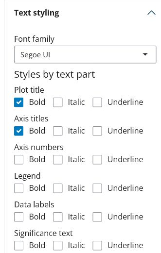

# Manual de Usuario BIOSZEN (Español)

Guía práctica para usar BIOSZEN desde archivos crudos hasta salidas reproducibles.

> **IMPORTANT:**
> Si es posible, usa el modo **Platemap + Curvas**. Es el flujo con mejor soporte para estadística, control de calidad de réplicas y exportaciones completas.

> **TIP:**
> Mantén este manual abierto mientras trabajas. Cada sección incluye acciones rápidas y referencia técnica.

## Mapa del Manual

- [1. Antes de Empezar](#1-antes-de-empezar)
- [2. Inicio Rápido por Escenario](#2-inicio-rápido-por-escenario)
- [3. Elegir un Modo de Entrada](#3-elegir-un-modo-de-entrada)
- [4. Especificaciones de Entrada](#4-especificaciones-de-entrada)
- [5. Flujo Estándar](#5-flujo-estándar)
- [6. Tipos de Gráfico y Controles](#6-tipos-de-gráfico-y-controles)
- [7. Normalización](#7-normalización)
- [8. Estadística](#8-estadística)
- [9. Anotaciones de Significancia](#9-anotaciones-de-significancia)
- [10. Control de Calidad y Réplicas](#10-control-de-calidad-y-réplicas)
- [11. Metadatos y Reproducibilidad](#11-metadatos-y-reproducibilidad)
- [12. Descargas](#12-descargas)
- [13. Módulo de Crecimiento](#13-módulo-de-crecimiento)
- [14. Guía de Solución de Problemas](#14-guía-de-solución-de-problemas)
- [15. Soporte](#15-soporte)

## 1. Antes de Empezar

Requisitos:

- R >= 4.1.
- BIOSZEN ejecutado desde `app.R` o `BIOSZEN::run_app()`.
- Archivo de datos para **Cargar datos** en `Excel` (`.xlsx`, `.xls`) o `CSV` (`.csv`).
- Archivo de curvas para **Cargar curvas** en `Excel` (`.xlsx`, `.xls`) o `CSV` (`.csv`) cuando las curvas no vienen embebidas en el workbook principal.

Plantillas de referencia disponibles en la app (**Archivos de entrada de referencia (descargar)**) y en:

- `inst/app/www/reference_files/`

Archivos de plantilla:

- [Ejemplo_platemap_parametros.xlsx](reference_files/Ejemplo_platemap_parametros.xlsx)
- [Ejemplo_curvas.xlsx](reference_files/Ejemplo_curvas.xlsx)
- [Ejemplo_parametros_agrupados.xlsx](reference_files/Ejemplo_parametros_agrupados.xlsx)
- [Ejemplo_input_summary_mean_sd.xlsx](reference_files/Ejemplo_input_summary_mean_sd.xlsx)

> **NOTE:**
> En la primera ejecución se pueden instalar dependencias en `R_libs`. Conserva esa carpeta para evitar reinstalaciones.

## 2. Inicio Rápido por Escenario

### Escenario A: Tengo datos crudos de placa y curvas (recomendado)

1. Carga el platemap en **Cargar datos**.
2. Carga el archivo de curvas en **Cargar curvas**.
3. Selecciona alcance y tipo de gráfico.
4. Aplica filtros y QC de réplicas.
5. Ejecuta estadística y anotaciones.
6. Exporta gráfico, tablas, metadatos y bundle ZIP.

### Escenario B: Solo tengo datos agrupados o resumen

1. Carga el archivo agrupado/resumen en **Cargar datos**.
2. Configura gráficos y filtros.
3. Ejecuta la estadística disponible para ese modo.
4. Exporta gráficos y metadatos.

### Escenario C: Necesito mejor rendimiento con alto volumen

1. Comienza con `.csv` en **Cargar datos**.
2. Mantén pocos parámetros seleccionados durante iteración.
3. Activa capas avanzadas solo al final.

## 3. Elegir un Modo de Entrada

- **Platemap + Curvas**  
  Ideal cuando: Necesitas el flujo más completo.  
  Limitaciones principales: Requiere mapeo estricto de wells y estructura de hojas.

- **Parámetros agrupados**  
  Ideal cuando: Solo necesitas parámetros y estadística.  
  Limitaciones principales: Curvas requiere hojas embebidas tipo `Curves_Summary` (o cargar un archivo aparte en **Cargar curvas**).

- **Resumen (Media/SD/N)**  
  Ideal cuando: No dispones de réplicas crudas por fila.  
  Limitaciones principales: Algunas rutas de normalidad/no paramétrica pueden limitarse.

- **Modo CSV**  
  Ideal cuando: Tienes datasets grandes y buscas IO más liviano.  
  Limitaciones principales: Metadatos siguen en `.xlsx`.

## 4. Especificaciones de Entrada

### 4.1 Workbook de platemap

Hojas requeridas:

- `Datos`: metadata + parámetros.
- `PlotSettings`: configuración de ejes por parámetro.

Columnas esperadas en `Datos`:

- `Well`: ID de pocillo (`A1`, `B3`, etc.), clave para vincular curvas.
- `Strain`: cepa o grupo biológico.
- `Media`: condición/tratamiento (`Control`, `Drug A`, etc.).
- `BiologicalReplicate`: ID de réplica biológica (`1`, `2`, `3`, ...).
- `TechnicalReplicate`: réplica técnica dentro de cada réplica biológica (`A`, `B`, `C` o `1`, `2`, `3`).
- `Replicate` (compatibilidad): campo alternativo legado para réplica biológica.
- `Orden`: entero para orden de visualización/exportación.
- Columnas de parámetros: una o más variables numéricas.

Regla práctica de consistencia:

- `Strain` + `Media` + `BiologicalReplicate` + `TechnicalReplicate` debería identificar cada fila experimental de forma estable.

Columnas esperadas en `PlotSettings`:

- `Parameter`
- `Y_Max`
- `Interval`
- `Y_Title`

### 4.2 Archivo de curvas

Excel (`.xlsx`, `.xls`):

- `Sheet1`: primera columna `Time`, columnas restantes por well (`A1`, `A2`, ...).
- `Sheet2`: `X_Max`, `Interval_X`, `Y_Max`, `Interval_Y`, `X_Title`, `Y_Title`.

CSV (`.csv`):

- Primera columna `Time`, columnas restantes por well (`A1`, `A2`, ...).
- Configuración de ejes auto-generada:
  - `X_Max` y `Y_Max`: máximos observados.
  - `Interval_X` y `Interval_Y`: `max/4`.
  - `X_Title` y `Y_Title`: vacíos por defecto.

> **WARNING:**
> Los errores de merge de curvas suelen deberse a inconsistencias entre `Well` (platemap) y los encabezados de curvas.

### 4.3 Modo parámetros agrupados

- Carga el archivo agrupado en **Cargar datos**.
- Diseñado para gráficos/estadística de parámetros desde hojas agrupadas (por ejemplo `Parametro_1`, `Parametro_2`, ...).
- Soporta curvas embebidas opcionales mediante hojas de resumen de curvas en el mismo workbook.
- Mantén el flujo en **Cargar datos** para archivos agrupados (no subirlos en **Cargar curvas**).

### 4.4 Modo resumen

- Carga el archivo resumen en **Cargar datos**.
- BIOSZEN detecta resumen de parámetros con cualquiera de estos nombres de hoja:
  - `Parameters_Summary`
  - `Parametros_Summary`
  - `Summary_Parameters`
  - `Resumen_Parametros`
- BIOSZEN detecta resumen de curvas embebidas con cualquiera de estos nombres:
  - `Curves_Summary`
  - `Curvas_Summary`
  - `Summary_Curves`
  - `Resumen_Curvas`
- Útil cuando no existen réplicas crudas por fila.
- El gráfico de curvas requiere un archivo válido en **Cargar curvas** o una hoja de resumen de curvas embebida.

### 4.5 Modo CSV

- **Cargar datos** acepta `.csv` y detecta delimitador automáticamente (`,`, `;`, tab, `|`).
- BIOSZEN intenta convertir perfiles no platemap a un formato compatible.
- **Cargar curvas** también acepta `.csv` (`Time` + wells).

### 4.6 Skill de IA opcional para preparar entradas

El repositorio fuente/GitHub incluye una skill opcional para agentes de IA en la
[carpeta de GitHub `skills/bioszen-platemap-curves/`](https://github.com/bioszen/BIOSZEN/tree/main/skills/bioszen-platemap-curves).
Para usarla, entrega ese URL de la carpeta de GitHub a la IA o agente
correspondiente para que lea o adquiera la skill. Si el agente necesita archivos
locales, descarga el ZIP del repositorio desde
<https://github.com/bioszen/BIOSZEN/archive/refs/heads/main.zip> y copia la
carpeta `skills/bioszen-platemap-curves/` al sistema de skills de tu agente.

Usa esta skill desde Codex, Claude, Antigravity u otras herramientas agénticas
similares cuando necesites generar un platemap `Datos` + `PlotSettings` desde
cualquier archivo legible con datos, corregir un platemap existente, reparar
errores de tipeo en nombres de parámetros entre columnas de `Datos` y
`PlotSettings$Parameter`, preparar un workbook de curvas separado, o validar
que `Datos$Well` coincida exactamente con los encabezados de curvas antes de
subir los archivos a BIOSZEN.

La skill es un extra de documentación/herramientas. No modifica la app BIOSZEN
y no asume nombres fijos de parámetros, etiquetas fijas de experimento ni un
tipo específico de medición.

## 5. Flujo Estándar

1. Carga el archivo principal de datos.
2. Opcionalmente carga/mergea curvas.
3. Opcionalmente carga metadatos.
4. Elige alcance (`Por cepa` o `Combinado`).
5. Elige tipo de gráfico.
6. Aplica filtros y selección de réplicas.
7. Opcionalmente normaliza por control.
8. Ejecuta estadística.
9. Agrega anotaciones de significancia.
10. Exporta salidas.

## 6. Tipos de Gráfico y Controles

### Caja

- Ideal para distribución de réplicas crudas.
- Controles: jitter, ancho de caja, tamaño de punto.
- Soporta anotaciones manuales/automáticas.
- `Voltear orientación (horizontal)` mejora legibilidad con etiquetas largas.

### Barras

- Ideal para comparación resumida por grupo.
- Soporta barras de error y puntos crudos opcionales.
- Orientación horizontal disponible.

### Violín

- Ideal para forma de distribución + réplica superpuesta.
- Comparte flujo de anotaciones con Caja/Barras.
- Orientación horizontal disponible.

### Apilado

- Selector y orden de parámetros.
- Configuración de barras de desviación y colores.
- La estadística y la significancia automática están disponibles por cada parámetro incluido. Las comparaciones se hacen dentro de cada parámetro, por ejemplo `Parámetro A - Grupo 1` contra `Parámetro A - Grupo 2`, no contra otro segmento apilado.
- Las etiquetas de significancia se pueden agregar sobre el grupo objetivo seleccionado para el parámetro seleccionado; la tabla de resultados incluye una columna `Parameter`.
- Para gráficos apilados se recomiendan las anotaciones como etiquetas.
- Orientación horizontal disponible; al voltear el gráfico se conservan leyendas, estilos de texto, barras de error y etiquetas de significancia.

### Correlación

- Selección de parámetros X/Y.
- Métodos: Pearson, Spearman, Kendall.
- Capas opcionales: recta, `r`, `p`, `R2`, ecuación.
- Panel avanzado con cribado uno-contra-todos y exportación Excel.

### Mapa de calor

- Selección de subconjunto de parámetros.
- Escalado: ninguno, por fila o columna.
- Clustering/dendrogramas opcionales.
- Etiquetas de valor en celdas opcionales.

### Matriz de correlación

- Selección múltiple de parámetros.
- Método de correlación + corrección de p-values.
- Opción de mostrar solo etiquetas significativas.

### Curvas

- Configura ejes, etiquetas y grosor.
- Elige geometría de línea e intervalo de confianza.
- Opción de mostrar trayectorias crudas de réplicas.

### Controles compartidos de apariencia

- El selector **Estadístico de barras de error** controla las barras de desviación cuando están disponibles:
  - `SD`/`DE`: media +/- desviación estándar.
  - `SEM`: media +/- error estándar.
  - `Min-Max`: mínimo observado a máximo observado; disponible solo en Caja.
- La sección desplegable **Estilo de texto** está disponible para gráficos individuales.
- **Familia tipográfica** se aplica a todo el texto del gráfico actual. Las opciones incluyen fuentes comunes de publicación y sistema como Helvetica, Arial, Calibri, Cambria, Segoe UI, Times New Roman, Georgia, Verdana y variantes relacionadas.
- Negrita, cursiva y subrayado se aplican de forma independiente por tipo de texto: título del gráfico, títulos de ejes, etiquetas de ticks de ejes, leyenda, etiquetas de datos y texto de significancia.
- El estilo de títulos de eje se aplica tanto al título del eje X como al del eje Y cuando esos títulos están visibles. El estilo de etiquetas de ticks se aplica a las etiquetas mostradas en los ejes, sean números o categorías.
- Los controles de leyenda incluyen si se muestra a la derecha cuando corresponde, además del tamaño y estilo del texto de la leyenda (normal, negrita, cursiva y/o subrayado).
- Cada tipo de texto puede tener su propia combinación de estilos; subrayar significancia, por ejemplo, no obliga a subrayar el título ni la leyenda.
- `Voltear orientación (horizontal)`, cuando está disponible, solo cambia la orientación visual. Conserva los mismos valores graficados, leyendas, familia tipográfica, ajustes de negrita/cursiva/subrayado, barras de error y anotaciones de significancia.
- Estos ajustes se aplican a la previsualización y se incluyen al exportar `PNG` y `PDF`.

### Panel de Composición

Pasos recomendados:

1. Desde cada gráfico, usar **Añadir al panel**.
2. Abrir pestaña **Panel de Composición**.
3. Seleccionar y ordenar gráficos.
4. Configurar layout (filas/columnas, malla, tamaño final).
5. Ajustar estilo (modo de leyenda, lado de leyenda, fuentes, tamaños, paleta).
6. Agregar texto enriquecido y overrides opcionales.
7. Exportar a `PNG`, `PPTX`, `PDF`.

Los controles de estilo de la composición se aplican en paralelo a todos los gráficos seleccionados. La sección **Estilo de texto** de composición replica los controles de gráficos individuales: la familia tipográfica se aplica a todo el texto de todos los gráficos, mientras que negrita/cursiva/subrayado se seleccionan por separado para títulos, ejes, leyendas, etiquetas de datos y texto de significancia. Las exportaciones de composición conservan estos ajustes en `PNG`, `PDF` y `PPTX`.

## 7. Normalización

Activa **Normalizar por control** y selecciona un medio control.

- BIOSZEN crea columnas con sufijo `_Norm`.
- Correlación permite normalizar por eje (`ambos`, `solo X`, `solo Y`).
- Si no hay emparejamiento estricto, se aplica lógica de respaldo.

## 8. Estadística

### Herramientas estadísticas principales

- Shapiro-Wilk: `stats::shapiro.test`
- Kolmogorov-Smirnov: `stats::ks.test`
- Anderson-Darling: `nortest::ad.test`
- ANOVA: `stats::aov`
- Kruskal-Wallis: `stats::kruskal.test`
- Rutas t-test: `rstatix::t_test`, `rstatix::pairwise_t_test`
- Rutas Wilcoxon: `rstatix::wilcox_test`
- Corrección múltiple: `stats::p.adjust`

Rutas post hoc por selección:

- Tukey / Games-Howell: `rstatix`
- Dunn: `rstatix::dunn_test`
- Dunnett: `DescTools::DunnettTest`
- Scheffe, Conover, Nemenyi, DSCF: `PMCMRplus`

Estadística de curvas (`S1`-`S4`):

El acordeón **Estadística de curvas** aparece para gráficos de Curvas. Selecciona uno o más métodos y luego usa **Ejecutar estadística de curvas** para generar la tabla de resultados.

- `S1`: `stats::lm` + `splines::ns` + `stats::anova`
- `S2`: `stats::pnorm` + `stats::pchisq`
- `S3`: `stats::pnorm`
- `S4`: `gcplyr::auc` + comparaciones guiadas por normalidad (`stats::t.test`, `stats::wilcox.test`, `stats::aov`, `stats::kruskal.test`)

Modos de comparación:

- Todos contra todos
- Control contra todos
- Par

Opciones de corrección p-value:

- Holm
- FDR
- Bonferroni
- Ninguna

Para gráficos **Apilados**, la normalidad y la significancia se calculan por separado para cada parámetro incluido. La tabla de salida incluye `Parameter`, y cada comparación por parámetro debe coincidir con la misma comparación ejecutada desde el gráfico de ese parámetro individual.

> **CAUTION:**
> En modo Resumen, la normalidad puede ser `NA` y algunas rutas no paramétricas que requieren datos crudos se desactivan.

## 9. Anotaciones de Significancia

Flujo manual:

1. Selecciona Grupo 1 y Grupo 2.
2. Ingresa etiqueta (`*`, `**`, `***`, `ns`, texto libre).
3. Agrega/reordena/edita/elimina anotaciones.

Flujo automático:

1. Ejecuta pruebas de significancia.
2. Abre opciones de auto-anotación.
3. Define inclusión (`solo significativos` o `todos`).
4. Elige formato (`estrellas` o `p-value`).
5. Reemplaza o agrega anotaciones.

Para gráficos **Apilados**, elige el parámetro antes de agregar una etiqueta. Las etiquetas automáticas conservan la identidad del parámetro y se ubican sobre el grupo objetivo seleccionado para ese parámetro.

## 10. Control de Calidad y Réplicas

Paneles QC para revisar:

- Valores faltantes.
- Outliers por grupo.
- Tamaño muestral y cobertura de réplicas.

### Réplicas biológicas

- Inclusión/exclusión manual.
- Filtrado automático por IQR.
- Selección Keep-N por reproducibilidad.

Comportamiento Keep-N:

- Ordena réplicas por distancia a la mediana del grupo entre parámetros.
- Conserva las de menor puntaje (más reproducibles).

### Réplicas técnicas

Disponible cuando hay estructura técnica válida:

- Pestaña dedicada de QC técnico.
- Selectores por grupo y réplica biológica.
- Botones globales seleccionar/deseleccionar.
- Detección automática de outliers técnicos por IQR.
- Keep-N técnico por subgrupo.

## 11. Metadatos y Reproducibilidad

Flujo de metadatos:

- **Descargar metadatos** para guardar estado actual.
- Reimportar metadatos en sesiones futuras.
- El estado de orientación horizontal se conserva en roundtrip.
- Las opciones tipográficas se conservan en el roundtrip de metadatos, incluyendo familia de letra, tamaños y estado normal/negrita/cursiva/subrayado para título del gráfico, títulos de eje X/Y, etiquetas de ticks de ejes, texto de leyenda, etiquetas de datos y texto de significancia.
- La visibilidad/posición de la leyenda, incluyendo la selección de leyenda a la derecha cuando corresponde, se guarda en metadatos y se aplica nuevamente al cargarlos.
- El estadístico de barras de error y la selección de métodos de estadística de curvas se conservan en el roundtrip de metadatos.

Bundle reproducible:

- Guardar versiones de gráficos en sesión.
- Exportar ZIP con gráficos + metadatos.
- Reabrir análisis con configuración consistente.

Cobertura de regresión incluye:

- Orientación horizontal solo en Caja/Barras/Violín/Apilado.
- Persistencia de metadatos roundtrip.
- Verificación de orientación en constructores finales.

## 12. Descargas

Salidas principales:

- Imagen de gráfico (`PNG`, `PDF`, según gráfico).
- Exportación de datos.
- Exportación de metadatos.
- Exportación de estadística.
- Bundle ZIP.
- Tabla de correlación avanzada.
- Exportación de merge platemap/curvas (si se usó merge).

Las exportaciones de gráficos conservan la configuración visual activa, incluyendo familia tipográfica, estilos por tipo de texto (negrita/cursiva/subrayado), estadístico de barras de error seleccionado, etiquetas de significancia y ajustes de ejes/leyenda. Las exportaciones de composición conservan los mismos controles tipográficos en todos los gráficos del layout.

## 13. Módulo de Crecimiento

Soporte de archivos en pestaña crecimiento:

- Tipo aceptado: `Excel` (`.xlsx`).
- Estructuras auto-detectadas:
  - Layout crudo tipo lector/Tecan (normalmente datos desde filas posteriores en `Sheet1`).
  - Tabla procesada desde `A1` (primera columna tiempo, siguientes columnas curvas/wells).

Parámetros extraídos:

- `uMax`: pendiente máxima en fase exponencial.
- `max_percap_time`: ventana temporal de máximo crecimiento per-cápita.
- `doub_time`: tiempo de duplicación (`ln(2) / uMax`).
- `lag_time`: transición previa al crecimiento exponencial.
- `ODmax`: señal/OD máxima medida.
- `max_time`: tiempo en que se alcanza `ODmax`.
- `AUC`: área bajo la curva.
- `OD0`: señal/OD inicial en el primer punto medido de cada curva.

Flujo típico:

1. Carga uno o más archivos de crecimiento.
2. Define tiempo máximo e intervalo.
3. Ejecuta extracción.
4. Descarga ZIP de resultados.
5. Reusa resultados en flujos de gráficos.

Autoguardado y manejo de interrupciones:

- La **Carpeta de autoguardado** opcional se puede escribir manualmente o seleccionar con **Examinar...**.
- Si no quieres autoguardado, deja esta carpeta en blanco y descarga el ZIP con **Descargar resultados** al final.
- Si escribes una carpeta, debe existir previamente. Si la ruta no existe, BIOSZEN muestra un mensaje para corregirla y no inicia esa corrida hasta que la ruta se corrija o se borre.
- Cuando se define una carpeta de autoguardado, los archivos finales `Curvas_*.xlsx` / `Parametros_*.xlsx` se copian allí automáticamente, y la opción normal **Descargar resultados** en ZIP sigue disponible.
- Durante procesos largos, BIOSZEN guarda puntos de control por well en una carpeta temporal `BIOSZEN_growth_checkpoints` dentro de la carpeta de autoguardado seleccionada. Estos puntos de control permiten reanudar una corrida interrumpida desde los wells ya completados, en lugar de empezar desde cero.
- Los puntos de control se eliminan automáticamente después de completar correctamente el proceso o después de reanudarlo con éxito. Solo se conservan cuando el procesamiento se interrumpe antes de terminar.
- **Detener proceso** solicita una cancelación segura. La app puede terminar el well/punto de control actual antes de liberar la corrida para que los archivos parciales sigan siendo utilizables y no se modifique el cálculo de parámetros de crecimiento.

## 14. Guía de Solución de Problemas

- **Error al cargar archivo**  
  Causa probable: Hojas/columnas obligatorias faltantes.  
  Qué hacer: Validar estructura y encabezados exactos.

- **No se genera gráfico**  
  Causa probable: Parámetro/grupo ausente tras filtros.  
  Qué hacer: Resetear filtros y validar disponibilidad.

- **Solo aparece Curvas en el selector de tipo de gráfico**  
  Causa probable: No se detectaron columnas de parámetros válidas en el archivo cargado.  
  Qué hacer: Revisar estructura de hojas agrupadas/resumen y encabezados de parámetros, luego recargar.

- **Normalización no disponible**  
  Causa probable: Falta medio control en alcance activo.  
  Qué hacer: Confirmar grupo control en el subconjunto.

- **Estadística deshabilitada**  
  Causa probable: Mismatch entre modo y prueba.  
  Qué hacer: Cambiar prueba o usar modo con datos compatibles.

- **Falla merge de curvas**  
  Causa probable: IDs de well inconsistentes.  
  Qué hacer: Alinear `Well` con columnas de curvas.

- **El workbook agrupado/resumen carga, pero Curvas queda sin datos**  
  Causa probable: Falta la hoja de resumen de curvas embebida.  
  Qué hacer: Agregar `Curves_Summary` (o alias) al workbook, o cargar curvas por separado en **Cargar curvas**.

- **CSV no reconocido**  
  Causa probable: Delimitador erróneo o headers faltantes.  
  Qué hacer: Revisar delimitador y columnas requeridas.

- **Rendimiento lento**  
  Causa probable: Demasiados parámetros/capas activas.  
  Qué hacer: Reducir parámetros y capas pesadas.

## 15. Soporte

Soporte y reporte de errores: `bioszenf@gmail.com`

